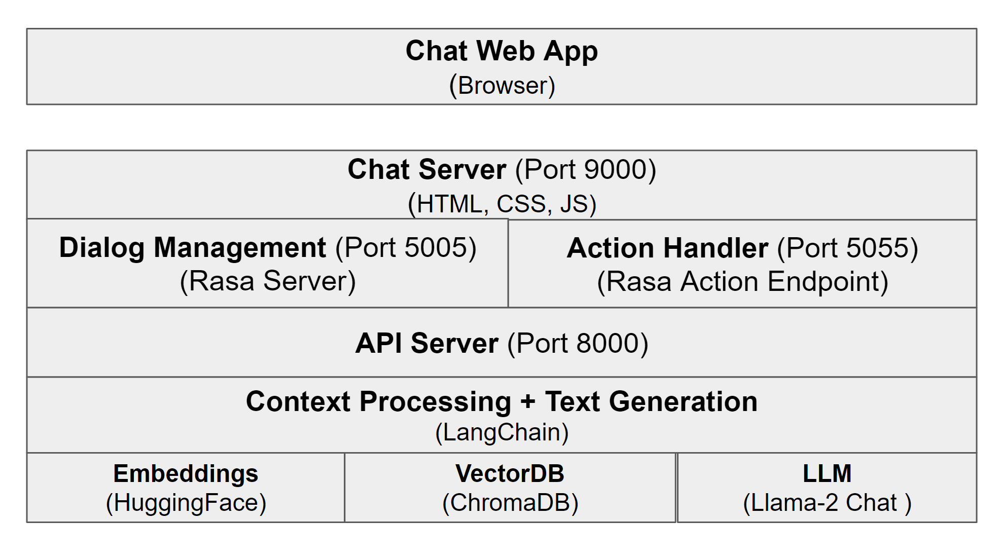
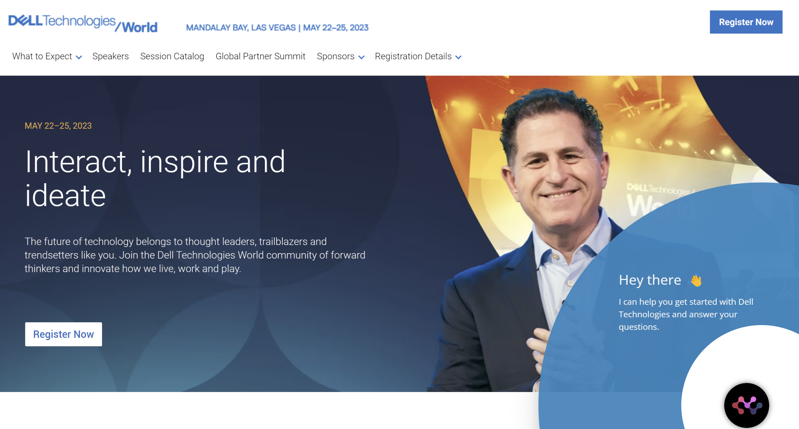

# Llama 2 Chatbot Application

## Introduction




The Chatbot application solution consists of the following modules
* [Chat Server](#chat-server)
* [RASA](#rasa)
    * [RASA Server - Dialogue Management](#rasa-server)
    * [RASA Action Endpoint - Action Handler](#rasa-action-endpoint)
* [API Server](#api-server)
    * [LangChain - Context Processing and Text Generation](#langchain---context-processing-and-text-generation)
    * [Text Embedding](#text-embedding)
    * [Chroma DB - Vector Database](#chroma-db---vector-database)
    * [Large Language Model (LLM) - Llama 2 ](#large-language-model-llm---llama-2)
---
### Chat Server
Chat Server hosts the Chatbot front end UI which will be accessed through any web browser.

---

### RASA

[RASA](https://rasa.com/docs/rasa/) is an open source conversational AI platform that allows you to understand and hold conversations, and connect to messaging channels and third party systems through a set of APIs.

The RASA platform consists of a [server](#rasa-server) and an [action endpoint](#rasa-action-endpoint).

#### RASA Server

A Rasa server is a software component that handles user requests, routes them to the appropriate model, and returns the response.

The RASA server is consists of a Natural Language Understanding(NLU) component which extracts structured information from user messages. A predefined action will be taken based on the extracted information.

#### RASA Action Endpoint

A [Rasa action endpoint](https://rasa.com/docs/rasa/action-server) is a way to execute custom actions in a Rasa conversational AI application. It is a HTTP endpoint that can be called by the Rasa server to execute custom code.

The custom action is defined to call the [API Server](#api-server) to get the response for the user query.

---
### API Server
The API server have the following functionalities
* Create [text embedding](#text-embedding) to store in a [vector database (Chroma DB)](#chroma-db---vector-database) from the user specified documents.
* Find answers to the questions by utilizing the vector database and a [Large Language Model (Llama-2 Chat)](#large-language-model-llm---llama-2) by leveraging a [context processing and text generation tool (LangChain)](#langchain---context-processing-and-text-generation)


The API server consists of the following modules.

* [LangChain - Context Processing and Text Generation](#langchain---context-processing-and-text-generation)
* [Text Embedding](#text-embedding)
* [Chroma DB - Vector Database](#chroma-db---vector-database)
* [Large Language Model (LLM) - Llama-2 Chat ](#large-language-model-llm---llama-2)

#### LangChain - Context Processing and Text Generation

[LangChain](https://github.com/hwchase17/langchain/tree/master) is a framework for developing applications powered by language models. It provides a number of features that make it easy to develop and deploy applications that use language models.

The application utilizes the [chains](https://python.langchain.com/en/latest/modules/chains/getting_started.html) functionality provided by LangChain. Chains allow us to combine different tools to create custom workflows that are tailored to this chatbot application. This application utilized the [`stuff chain`](https://python.langchain.com/en/latest/modules/chains/index_examples/qa_with_sources.html?highlight=stuff#the-stuff-chain).

#### Text Embedding

A text embedding is a way of representing text as a vector of numbers. The application utilizes method of creating embedding using a [`sentence-transformers/all-mpnet-base-v2`](https://huggingface.co/sentence-transformers/all-mpnet-base-v2) model from [Hugging Face](https://huggingface.co/) to create embedding for the user provided documents.

The created embedding will be stored in a vector database such as [Chrome DB](https://github.com/chroma-core/chroma). The text functionality is enabled through [LangChain](#langchain---context-processing-and-text-generation).

#### Chroma DB - Vector Database

Chrome DB is an opensource vector database (also known as embedding database). Embeddings databases (also known as vector databases) store embeddings and allow you to search by nearest neighbors rather than by substrings like a traditional database.

#### Large Language Model (LLM) - Llama 2


A large language model, or LLM, is a deep learning algorithm that can recognize, summarize, translate, predict and generate text and other content based on knowledge gained from massive datasets.This is done by training on a large corpus of text. LLMs are used in a variety of natural language processing (NLP) tasks, such as machine translation, text summarization, and question answering.

This chatbot application uses the [**Llama 2 Chat**](https://huggingface.co/meta-llama/Llama-2-7b-chat-hf) model from Hugging Face for generating responses.


---
## Deploying Chatbot

### Pre-requisites
Before starting the Llama-2 chat application, ensure you have the following prerequisites installed:

- Ubuntu 22.04
- [Nvidia CUDA Toolkit v12.2.1 or latest](https://docs.nvidia.com/cuda/archive/12.2.1/cuda-toolkit-release-notes/index.html)
- [Docker Engine v23 or latest](https://docs.docker.com/engine/install/ubuntu/#installation-methods)
- [Nvidia Container Toolkit v1.14.0 or latest](https://docs.nvidia.com/datacenter/cloud-native/container-toolkit/1.14.0/install-guide.html)

Note:
- The chat application is tested on Nvidia A100 GPU.


### Llama 2 Model Access
Request access for Llama 2 model from Hugging Face: [Llama-2-7B-Chat-HF](https://huggingface.co/meta-llama/Llama-2-7b-chat-hf)

## Configure Chatapp
1. Use the below information to update the [.env](./.env) file:
    | Environment Variable          | Description                   | Values |
    |------------------------|-----------------------|------------------|
    | `HF_TOKEN` *   | HuggingFace access token to authenticate user |  To be updated by user (required)  |
    | `IP_ADDRESS`   | Host machine IP address |   `localhost`  |
    | `MODEL_NAME` | Huggingface model id for Llama 2 models | `meta-llama/Llama-2-7b-chat-hf` (default) |
    | `PRECISION`  | Model precision | `BF16` (default), `FP4`, `FP16`, `FP32`, `INT8` |
    | `DEVICE` | Device to load model | `cuda` (default), `cpu` |
    | `MAX_NEW_TOKENS` | Maximum new tokens to be generated by model | `250` |
    | `TEMPERATURE` | Model temperature to control randomness of generated text | `0.8` |

    Note:
    - Set `IP_ADDRESS=localhost` incase of accessing chat ui in same machine.
    - Set `IP_ADDRESS=IP_ADDRESS_OF_HOST_MACHINE` incase of acccessing chat ui from machine in same network.
    - To update the background image in chatbot home page, replace  `chat-app\chatbot-ui\app\static\img\background.png` (the filename should remain the same).
    - FP16, INT8 and FP4 is supported only on GPU.
    - INT8 can be run on 8-bit tensor core-supported hardware, which are Turing and Ampere GPUs.

2. Build docker images:
    ```sh
    docker compose build
    ```
3. Add PDF files to `chat-app\api-server\docs` folder to set context for model.


## Run Chatapp
1. Start API server and chat UI:
    ```sh
    docker compose up -d
    ```
2. Check the health of docker containers:
    ```sh
    docker compose ps
    ```
    **Note**:
    - It might take several minutes to start API server depending upon network bandwidth and model load time.
    - To check the progress of download, check the api-server logs by performing below command:
        ```sh
        docker compose logs api-server
        ```
    - Make sure `chat-ui` container status is `healthy` before accessing chat interface. The `chat-ui` container will change to `healthy` status once `api-server` is ready for inference.
    - To feed more content to chat application, add more PDF files to  `chat-app\api-server\docs` folder and restart the containers:
        ```sh
        docker compose restart
        ```
3. To access the chatbot UI, open below link in a browser:
    http://localhost:9000/

    

    **Note**:
    - To access the chatbot UI from a machine connected to same network:
        `http://IP_ADDRESS_OF_HOST_MACHINE:9000/`
