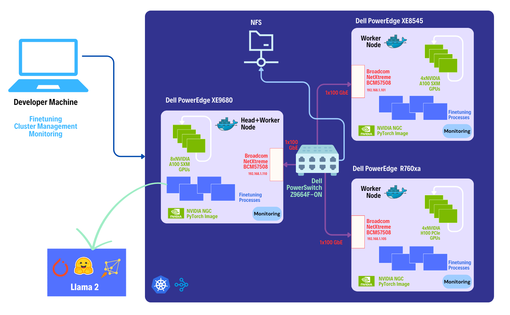
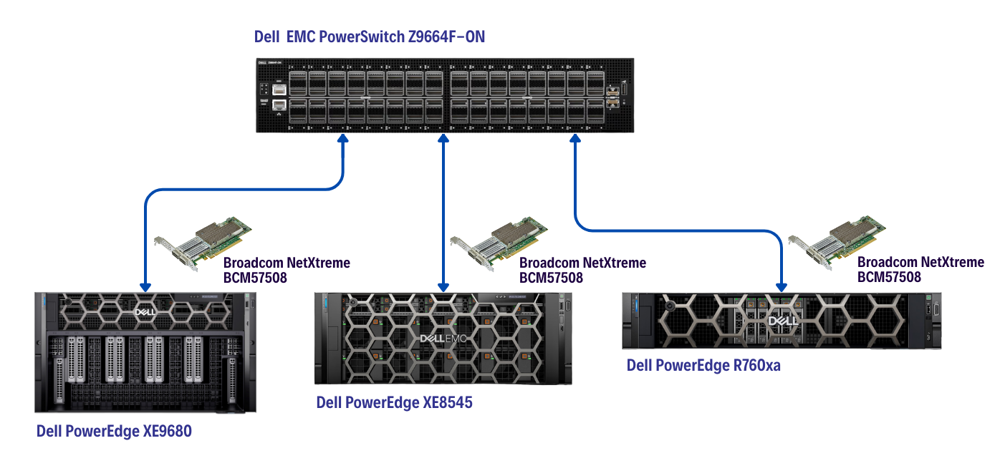

# Fine-Tuning Llama 2: Maximizing Potential Across Heterogeneous Dell PowerEdge Servers with Broadcom Network Adapters

Fine-tune Llama 2 (7B/13B/70B) Large Language Models efficiently at scale by leveraging heterogeneous Dell PowerEdge servers in a distributed manner.

The developer documentation provides a comprehensive guide for fine-tuning [Llama 2 Large Language Models (LLMs)](https://ai.meta.com/llama/) in a distributed environment, using [Dell PowerEdge servers](https://www.dell.com/en-in/work/shop/dell-poweredge-servers/sc/servers) networked with [Broadcom Ethernet Network Adapters](https://www.broadcom.com/products/ethernet-connectivity/network-adapters). This document aims to empower developers with the knowledge and tools necessary to optimize LLMs for specific tasks or domains through the fine-tuning process. By leveraging the computational power of [Dell PowerEdge servers](https://www.dell.com/en-in/work/shop/dell-poweredge-servers/sc/servers), networking capability of [Broadcom Ethernet Network Adapters](https://www.broadcom.com/products/ethernet-connectivity/network-adapters) and the scalability with Kubernetes, developers can efficiently fine-tune LLMs to meet their application requirements.

  

## Prerequisites

### Software Requirements

Before we start, make sure you have the following software components set up on your Dell PowerEdge servers:

* Ubuntu Server 22.04, with kernel v5.15 or higher
* [Docker v24.0 or later](https://docs.docker.com/engine/install/ubuntu/)
* [NVIDIA CUDA Toolkit v12.2.1](https://docs.nvidia.com/cuda/cuda-toolkit-release-notes/index.html)

### Hardware Requirements

Additionally, ensure you have the following hardware components at your disposal:

* [Dell PowerEdge Servers](https://www.dell.com/en-in/work/shop/dell-poweredge-servers/sc/servers) equipped with [NVIDIA GPUs](https://www.nvidia.com/en-in/data-center/data-center-gpus/)
* [Broadcom Ethernet Network Adapters](https://www.broadcom.com/products/ethernet-connectivity/network-adapters)
* [Dell PowerSwitch Z9664F-ON](https://www.dell.com/en-in/work/shop/ipovw/networking-z-series)

Below, you'll find the intricate network topology employed in our tests.

 

## 1. Setting up a Distributed Cluster

*Estimated Time: 40 mins ⏱️*

Setting the stage for distributed fine-tuning, we'll delve into configuring our cluster with precision. Using [Kubernetes](./docs/cluster_setup.md#k3s-setup-on-server-and-agent-nodes) as our orchestration system, we'll establish a cluster comprising a designated [server/head node](./docs/cluster_setup.md#server-node-setup) node and multiple [agent/worker nodes](./docs/cluster_setup.md#agent-node-setup) nodes. The flexibility lies in your hands: you can choose to include the head node in the distributed training process or opt for an additional worker node on the same machine as the head node, enhancing the power of your computational setup.

To optimize our resources further, we'll integrate [Nvidia device plugins for Kubernetes](./docs/cluster_setup.md#nvidia-device-plugins-for-kubernetes) using [Helm](./docs/cluster_setup.md#installing-helm). This streamlined integration ensures that our distributed training environment is equipped with the necessary acceleration capabilities.

Additionally, to facilitate seamless data access, we'll set up a robust [Network File System (NFS)](./docs/cluster_setup.md#network-file-system-nfs-setup). This vital component ensures that our agent nodes can effortlessly access datasets and saved model files during the fine-tuning process.

## 2. KubeRay Installation and Ray Cluster Configuration

*Estimated Time: 40 mins ⏱️*

We'll introduce [KubeRay](./docs/raycluster_setup.md#kuberay-installation) to our Kubernetes cluster. Utilizing KubeRay, we'll deploy powerful [Ray Clusters](./docs/raycluster_setup.md#ray-cluster-configuration) tailored specifically for our fine-tuning tasks using a [custom built docker image](./docs/raycluster_setup.md#creating-fine-tuning-docker-images-and-kubernetes-secrets) which leverages [NVIDIA PyTorch images](https://catalog.ngc.nvidia.com/orgs/nvidia/containers/pytorch). This step guarantees a robust and scalable infrastructure for our distributed jobs.

## 3. Finetuning the Llama 2 7B/13B Model

*Estimated Time: 1hr 10 mins ⏱️*

We will be executing the distributed fine-tuning of the cutting-edge [Llama 2 7B](./docs/finetuning_llama2.md#finetuning-the-llama-2-7b-model) model developed by Meta AI. To accomplish this, we're harnessing the power of two robust tools: [HuggingFace Accelerate](https://github.com/huggingface/accelerate) and [DeepSpeed](https://github.com/microsoft/DeepSpeed), ensuring an efficient and scalable workflow.

  

You have the flexibility to choose datasets from HuggingFace or your own sources for fine-tuning. Simply convert the selected dataset into the [compatible format](./docs/finetuning_llama2.md#creating-dataset-for-fine-tuning), and you're ready to initiate the training process.

Once your data is ready, dive into the intricacies of defining [fine-tuning jobs](./docs/finetuning_llama2.md#defining-fine-tuning-job), tailoring [configurations](./docs/finetuning_llama2.md#defining-fine-tuning-job) to match the unique needs of your project.

We will assess the efficiency of [Broadcom Network Adapters](https://www.broadcom.com/products/ethernet-connectivity/network-adapters) for distributed training by closely monitoring the [network bandwidth usage](./docs/finetuning_llama2.md#network-adapter-efficiency-analysis) of each node within our fine-tuning cluster.

## 4. Tracking Real-time Progress

The [Ray Dashboard](./docs/finetuning_llama2.md#tracking-real-time-progress) offers real-time insights into the process. Accessible at http://127.0.0.1:30265, this dashboard grants you access to the **Jobs** tab, allowing you to monitor job statuses and logs. Meanwhile, the **Cluster** tab provides a comprehensive overview of device statistics across your cluster, ensuring you're always in control.

The finetuned model's checkpoint file is securely archived in the network file system, residing exactly where your [fine-tuning configuration](./docs/finetuning_llama2.md#defining-fine-tuning-job) dictated.

## 5. Evaluating Fine-Tuned Llama 2 Model

Upon completion of the fine-tuning process for the Llama 2 7B model with the medical domain dataset, we conducted a series of [sample inferences](./docs/model_evaluation.md#evaluation-results-of-fine-tuned-llama-2-7b-model) to directly compare the fine-tuned model's results with those of the base model, providing a comprehensive insight into its enhanced capabilities.

## 6. Running Inference with Chatbot

Use the fine-tuned model to [run a chatbot](./infer/README.md) using Gradio.

## Let's Dive Deep

This comprehensive guide will walk you through every step, from setting up a powerful Kubernetes cluster to fine-tuning Llama 2 model and evaluating its performance.

* [Setting up a Distributed Cluster](./docs/cluster_setup.md#setting-up-a-distributed-cluster)
    * [K3S Setup on Server and Agent Nodes](./docs/cluster_setup.md#k3s-setup-on-server-and-agent-nodes)
    * [Installing Helm](./docs/cluster_setup.md#installing-helm)
    * [NVIDIA Device Plugins for Kubernetes](./docs/cluster_setup.md#nvidia-device-plugins-for-kubernetes)
    * [Network File System setup](./docs/cluster_setup.md#network-file-system-nfs-setup)
        * [Setting up NFS Server](./docs/cluster_setup.md#setting-up-nfs-server)
        * [Persistent Volume and Persistent Volume Claims](./docs/cluster_setup.md#creating-the-kubernetes-persistent-volume-and-claims-for-nfs)
* [KubeRay Installation and Ray Cluster Configuration](./docs/raycluster_setup.md#kuberay-installation-and-ray-cluster-configuration)
    * [KubeRay Installation](./docs/raycluster_setup.md#kuberay-installation)
    * [Ray Cluster Configuration](./docs/raycluster_setup.md#ray-cluster-configuration)
        * [Fine-Tuning Docker Images and Kubernetes Secrets](./docs/raycluster_setup.md#creating-fine-tuning-docker-images-and-kubernetes-secrets)
        * [Configuring Ray Cluster](./docs/raycluster_setup.md#configuring-the-cluster)
        * [Deploying Ray Cluster](./docs/raycluster_setup.md#deploying-ray-cluster)
    * [Accessing Ray Dashboard](./docs/raycluster_setup.md#accessing-the-ray-dashboard)
    * [Our Test Cluster for Llama 2 7B Fine-Tuning](./docs/raycluster_setup.md#our-test-cluster-for-llama-2-7b-fine-tuning)
* [Finetuning Llama 2](./docs/finetuning_llama2.md#fine-tuning-llama-2-models)
    * [Prerequisites](./docs/finetuning_llama2.md#prerequisites)
    * [Creating Dataset for Fine-Tuning](./docs/finetuning_llama2.md#creating-dataset-for-fine-tuning)
    * [Defining Fine-Tuning Job](./docs/finetuning_llama2.md#defining-fine-tuning-job)
    * [Running Llama 2 7B Fine-Tuning](./docs/finetuning_llama2.md#running-llama-2-7b-fine-tuning)
    * [Tracking Real-time Progress](./docs/finetuning_llama2.md#tracking-real-time-progress)
    * [Network Adapter Efficiency Analysis](./docs/finetuning_llama2.md#network-adapter-efficiency-analysis)
* [Evaluating Fine-Tuned Llama 2 Model](./docs/model_evaluation.md)
    * [Evaluation Results of Fine-Tuned Llama 2 7B Model](./docs/model_evaluation.md#evaluation-results-of-fine-tuned-llama-2-7b-model)
* [Chatbot on Fine-Tuned Llama 2 Model](./infer/README.md)

## Learn More

To gain a comprehensive understanding of every facet involved in fine-tuning a Large Language Model (LLM) for various tasks, explore the following resources:

| Resource | Details |
| --- | --- |
| [Llama 2 LLM Model](./docs/model_details.md) | Explore the intricacies of the advanced Llama 2 LLM model. |
| [PubMedQA Dataset and Preprocessing](./docs/dataset_preprocessing.md) | Delve into the details of the PubMedQA medical dataset and the preprocessing techniques essential for effective fine-tuning. |
| [Fine-Tuning Methodologies](./docs/training_methodologies.md) | Gain insights into the popular and open-source fine-tuning methodologies currently in use. |
| [LLM Guardrails](./docs/guardrails.md) | Learn about the ethical and responsible boundaries that ensure the ethical operation of your LLM models. |
