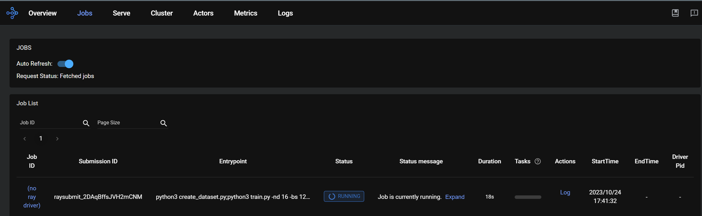
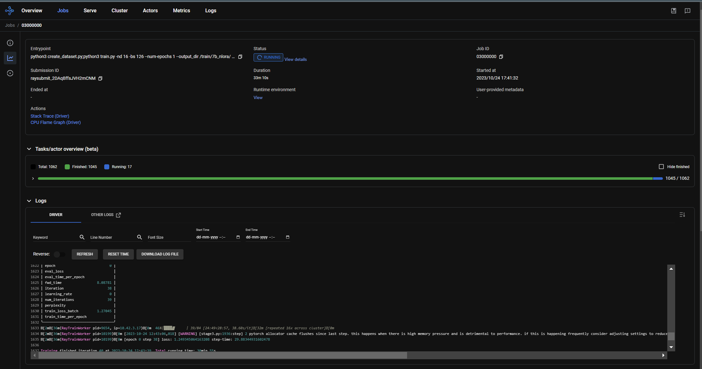

# Finetuning the Llama 2 7B Model
**Estimated Time for Fine-Tuning 1 Epoch with 126 Batch Size: 1hr 10 mins ⏱️**

Here we are taking a pretrained [LLaMA 2 7B](https://ai.meta.com/llama/) large language model and fine-tuning on a medical domain [PubMedQA dataset](https://huggingface.co/datasets/pubmed_qa). You have the flexibility to execute and monitor the fine-tuning process from any developer machine.

The distributed fine-tuning of Llama 2 7B model is enabled by the libraries below

* [**KubeRay**](https://github.com/ray-project/kuberay): A Kubernetes operator that acts as a orchestration framework
for doing training on distributed setup.
* [**Accelerate**](https://github.com/huggingface/accelerate): Provides the distributed training capabilities to PyTorch code.
* [**DeepSpeed**](https://github.com/microsoft/DeepSpeed): Provides of set of algorithms that make distributed training more efficient.

1. [**KubeRay**](https://github.com/ray-project/kuberay) is responsible for setting up the Ray cluster, i.e., setting up pods on the requested machines. It then handles the pod lifecycles (i.e. checking that they are alive, restarting pods if they are unresponsive, etc.). The pods can be started with different docker images, but they must be able to communicate through Ray. Additionally, KubeRay handles job submission, and also provides a dashboard that contains metrics from all of the
machines currently in the cluster.
2. [**Accelerate**](https://github.com/huggingface/accelerate) is then used by Ray to easily distribute the current PyTorch fine-tuning code across multiple nodes. The accelerate library mostly acts as a wrapper, so the configuration options that you can pass it are actually configuration options of the underlying libraries, such as DeepSpeed, and not of accelerate itself.
3. [**DeepSpeed**](https://github.com/microsoft/DeepSpeed) is used the set parameters to determine how exactly to split the objects used in the training, and what types of optimizations to use. There are many different configuration options you can use on DeepSpeed. The info on some of the configurations you can use is already on the repo. The critical configurations that can be set are the use of ZeRO Stage 3, and further extensions of ZeRO Stage 3, as this stage enables most optimizations that DeepSpeed provides for distributed training.

For in-depth technical insights into the Llama 2 7B model, please refer [here](./model_details.md#llama-2-large-language-model).

## Table of Contents
* [Prerequisites](#prerequisites)
* [Creating Dataset for Fine-Tuning](#creating-dataset-for-fine-tuning)
* [Defining Fine-Tuning Job](#defining-fine-tuning-job)
* [Running Llama 2 7B Fine-Tuning](#running-llama-2-7b-fine-tuning)
* [Tracking Real-time Progress](#tracking-real-time-progress)
* [Network Adapter Efficiency Analysis](#network-adapter-efficiency-analysis)

## Prerequisites
* [HuggingFace API Token](https://huggingface.co/docs/hub/security-tokens)
* [Access to Llama 2 Models](https://huggingface.co/meta-llama)

## Creating Dataset for Fine-Tuning

You can bring your own dataset or choose to use dataset from Hugging Face.

The fine-tuning expects the dataset to be available as a single `json` file with below format.

```json
{"question":"Do mitochondria play a role in remodelling lace plant leaves during programmed cell death?", "context":"Programmed cell death (PCD) is the regulated death of cells within an organism. The lace plant (Aponogeton madagascariensis) produces perforations in its leaves through PCD. The role of mitochondria during PCD has been recognized in animals; however, it has been less studied during PCD in plants.", "answer":"Results depicted mitochondrial dynamics in vivo as PCD progresses within the lace plant, and highlight the correlation of this organelle with other organelles during developmental PCD."}
{"question":"Syncope during bathing in infants, a pediatric form of water-induced urticaria?", "context":"Apparent life-threatening events in infants are a difficult and frequent problem in pediatric practice. The prognosis is uncertain because of risk of sudden infant death syndrome.", "answer":"\"Aquagenic maladies\" could be a pediatric form of the aquagenic urticaria."}
```

If your dataset is in any other format, convert the dataset to the supported format as described above.

We will use the [PubMedQA dataset](https://huggingface.co/datasets/pubmed_qa), `pqa_artificial` subset here as an example.

Running the command below will convert the PubMedQA pqa_artificial dataset to supported format to a `dataset_dir/dataset.json` file.

1. Install the `datasets` package on python
    ```sh
    pip3 install datasets==2.14.6
    ```
2. Create the dataset file
    ```sh
    cd ./training/preprocess
    ```
    ```sh
    python3 preprocessing.py
    ```
3. Copy the generated `dataset.json` file to your NFS directory.

Explore [this section](./dataset_preprocessing.md#pubmedqa-dataset-preprocessing) for detailed insights into the PubMedQA dataset and the preprocessing techniques applied here.

## Defining Fine-Tuning Job

The fine-tuning process can be submitted as jobs to the Ray Cluster using the [Ray Python SDK](https://docs.ray.io/en/latest/cluster/running-applications/job-submission/sdk.html).

Create a python script as below to submit a Llama 2 7B model fine-tuning job.

```python
from ray.job_submission import JobSubmissionClient

# Update the <Head Node IP> to your head node IP/Hostname
client = JobSubmissionClient("http://<Head Node IP>:30265")

fine_tuning = (
    "python3 create_dataset.py \
    --dataset_path /train/dataset.json \
    --prompt_type 1 \
    --test_split 0.2 ;"
    "python3 train.py \
    --num-devices 16 \
    --batch-size-per-device 126 \
    --model-name meta-llama/Llama-2-7b-hf \
    --output-dir /train/ \
    --ds-config ds_7b_13b.json \
    --hf-token <HuggingFace Token> "
)
submission_id = client.submit_job(entrypoint=fine_tuning,)

print("Use the following command to follow this Job's logs:")
print(f"ray job logs '{submission_id}' --address http://<Head Node IP>:30265 --follow")
```

The fine-tuning job runs two processes
1. Creating dataset for fine-tuning

    The dataset passed for the training will be tokenized and stored in a specific format for the fine-tuning process by the [create_dataset.py](../training/src/create_dataset.py) script.

    The supported configurations supported by the dataset creation script are below
    | Name | Description | Default Value |
    | -- | --- | --- |
    | `--dataset_path` | Full path to the dataset file stored in NFS in json format. <br> Utilize the dataset.json file path along with the mounted NFS directory path in the cluster configuration. |  |
    | `--prompt_type` | Prompt used for fine-tuning. | `1` |
    | `--test_split` | Ratio of test/train. | `0.2` |

2.  Fine-tuning LLM Models

    All configurations supported by the fine-tuning script [train.py](../training/src/train.py) is provided here.

    The supported configurations for the fine-tuning script as below.
    | Name | Description | Default Value |
    | -- | --- | --- |
    | `--num-devices`, `-nd` | Number of GPUs to use for fine-tuning. | `4` |
    | `--batch-size-per-device`, `-bs` | Batch size for each GPU. <br> Total batch size is calculate as `nd`*`bs` | 16 |
    | `--model-name`, `-mn` | LLM Model name from HuggingFace hub. <br> Use the model name available on huggingface hub. | `meta-llama/Llama-2-7b-hf` |
    | `--hf-token`, `-hft` | HuggingFace API Token. | |
    | `--num-epochs`, `-ne` | Number of epochs to finetune. | `1` |
    | `--ds-config`, `-dc` | Deepspeed config file for fine-tuning. <br> Refer to [DeepSpeed Configuration JSON page](https://www.deepspeed.ai/docs/config-json/) to know more. | `ds_7b_13b.json` |
    | `--output-dir` | fine-tuning checkpoint saving directory. <br> *Note: Add path mounted from NFS as output_dir.* | |
    | `--ctx-len` | Input context length. <br> Llama 2 upto supports 4096 input context length. | `512` |
    | `--eval-batch-size-per-device`, `-ebs` | Batch size per device for evaluation. | `2` |
    | `--grad-accum`, `-ga` | Gradient accumulation steps. |  `1` |
    | `--mx` | Whether to use mixed precision. <br> Supported: `fp16`, `bf16` | `bf16` |
    | `--learning-rate`, `-lr` | Learning rate for use in fine-tuning. | `5e-6` |


The training configuration we tested on our cluster for the Llama 2 7B fine-tuning is as below.

| Devices | Number of GPUs | Context Length | DeepSpeed Config | Batch Size Per GPU | Estimated Training Time |
| -- | --- | --- | --- | -- | -- |
| 1 | 4xA100 80 GB SXM | 512 |  ds_7b_13b.json | 32 | 120 minutes |
| 3 | 12xA100 80 GB SXM <br> 4xH100 80 GB PCIe | 512 | ds_7b_13b.json | 126 | 46 minutes |

> *Note: To know more about our test cluster for Llama 2 7B fine-tuning refer [here](./raycluster_setup.md#our-test-cluster-for-llama-2-7b-fine-tuning).*

## Running Llama 2 7B Fine-Tuning

To start the Llama 2 7B fine-tuning on the PubMedQA dataset, follow the commands below

1. Install [ray](https://github.com/ray-project/ray) python package.

    ```sh
    pip3 install ray[default]==2.7.1
    ```
3. Submit the job to start Llama 2 7B fine-tuning.

    ```sh
    python3 job.py
    ```

> *Note: Be mindful to monitor the disk usage on your NFS system, as the training process automatically generates checkpoint files for every epoch.*

## Tracking Real-time Progress

The fine-tuning jobs on the Ray Cluster can be monitored through the methods outlined below.
### Using Ray CLI

To track/follow the submitted jobs using Ray CLI from any machine,

1. Retrieve the submission ID for the desired job.
2. Utilize the following Ray CLI command to track job logs:

    ```sh
    ray job logs <Submission ID> --address http://<Head Node IP>:30265 --follow
    ```
    Ensure to replace `<Submission ID>` and `<Head Node IP>` with the appropriate values.

### Using Ray Dashboard

The Ray Dashboard provides a comprehensive overview of all training jobs submitted to the cluster, accompanied by detailed cluster resource usage metrics.

To check the status of fine-tuning jobs, simply visit the **Jobs** page on your Ray Dashboard at [localhost:30265](http://localhost:30265) and select the specific job from the list.





## Network Adapter Efficiency Analysis

To gauge the network adapter efficiency during the Llama 2 7B fine-tuning process, we utilized the [net](https://github.com/influxdata/telegraf/tree/master/plugins/inputs/net) plugin from [Telegraf](https://github.com/influxdata/telegraf) across all three nodes.

Our fine-tuning cluster comprises three powerful Dell PowerEdge servers: [Dell PowerEdge XE9680](https://www.dell.com/en-in/work/shop/ipovw/poweredge-xe9680), [Dell PowerEdge XE8545](https://www.dell.com/en-us/shop/ipovw/poweredge-xe8545), and [Dell PowerEdge R760xa](https://www.dell.com/en-us/shop/dell-poweredge-servers/poweredge-r760xa-rack-server/spd/poweredge-r760xa/pe_r760xa_16902_vi_vp). Each node in our test cluster is equipped with 1x [BCM57508 NetXtreme-E 100 GbE](https://www.broadcom.com/products/ethernet-connectivity/network-adapters/p2100g). For an in-depth look at our fine-tuning cluster, refer to [Our Test Cluster for Llama 2 7B Fine-Tuning](./raycluster_setup.md#our-test-cluster-for-llama-2-7b-fine-tuning).

Below, you'll find our detailed observations on bandwidth usage measured during the fine-tuning process of the Llama 2 7B model, employing a batch size of 126 per GPU.

| Device | Average Received Bandwidth(rx) | Average Transmitted Bandwidth(tx) | Average Total Bandwidth(rx+tx) | Maximum Received Bandwidth(rx) | Maximum Transmitted Bandwidth(tx) | Maximum Total Bandwidth(rx+tx) |
| ---- | --- | --- | --- | --- | --- | --- |
| [Dell PowerEdge XE9680](https://www.dell.com/en-in/work/shop/ipovw/poweredge-xe9680) | 9.25 Gbits/sec | 9.18 Gbits/sec | 18.4 Gbits/sec | 46 Gbits/sec | 46.2 Gbits/sec | 92.2 Gbits/sec   |
| [Dell PowerEdge XE8545](https://www.dell.com/en-us/shop/ipovw/poweredge-xe8545) | 9.17 Gbits/sec | 9.25 Gbits/sec | 18.4 Gbits/sec | 44.3 Gbits/sec | 44.2 Gbits/sec | 88.5 Gbits/sec   |
| [Dell PowerEdge R760xa](https://www.dell.com/en-us/shop/dell-poweredge-servers/poweredge-r760xa-rack-server/spd/poweredge-r760xa/pe_r760xa_16902_vi_vp) | 9.26 Gbits/sec | 9.25 Gbits/sec | 18.5 Gbits/sec | 43.6 Gbits/sec | 43.3 Gbits/sec | 86.9 Gbits/sec |
