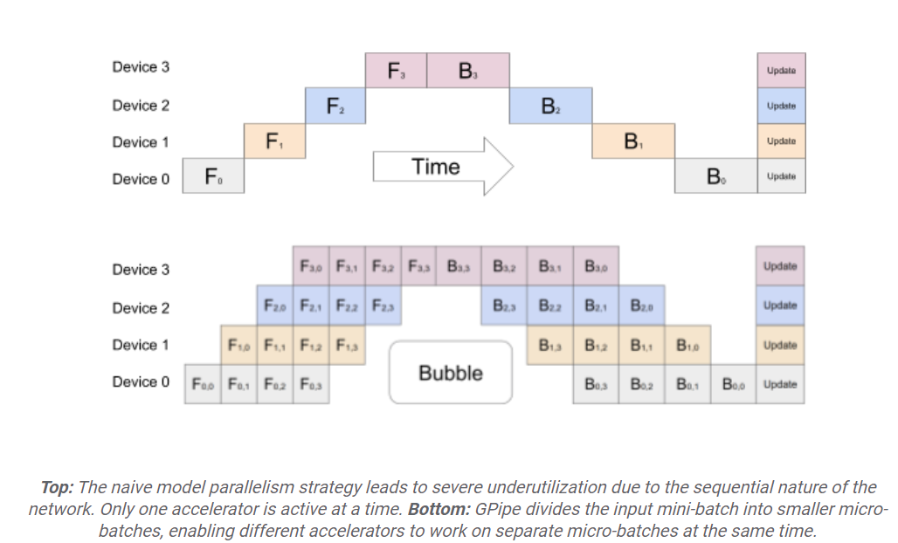
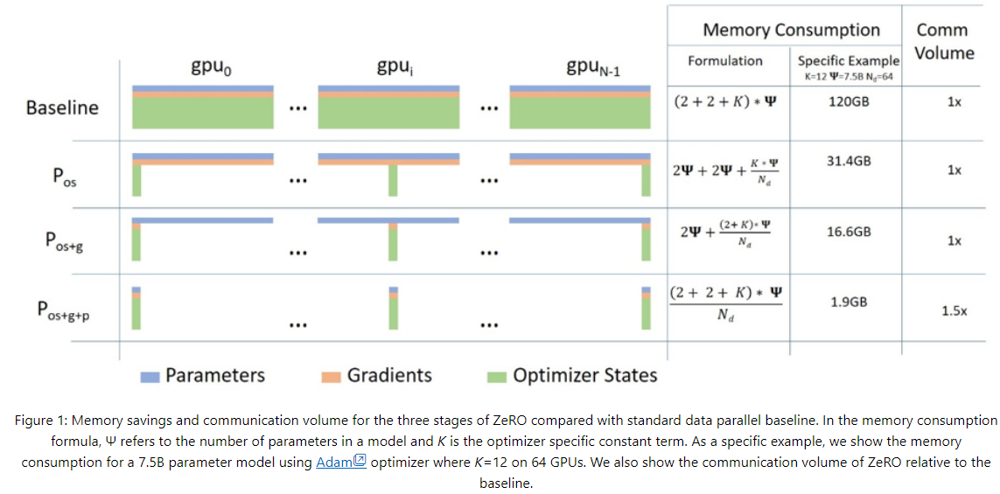

# Distributed Fine-Tuning Methodologies

There are many different distributed fine-tuning methodologies, each serving a different purpose. Choosing the right methodology can reduce training times drastically.

In this document, we describe general distributed fine-tuning methodologies, and introduce Microsoft's widely used ZeRO optimizer, which drastically reduces memory and bandwidth consumption.

## Table of contents

* [Preliminaries](#preliminaries)
* [Parallelism Strategies](#parallelism-strategies)
    * [Data Parallelism](#data-parallelism)
    * [Model Parallelism](#model-parallelism)
    * [Tensor Parallelism](#tensor-parallelism)
* [Zero Redundancy Optimizer (ZeRO)](#zero-redundancy-optimizer-zero)
    * [ZeRO Variants](#zero-variants)
    * [Hyperparameter Examples](#hyperparameters-examples)
* [Further Reading](#further-reading)

## Preliminaries

Several different objects are needed for training a model:

* Parameters: This is the model that is to be trained.
* Optimizer: This calculates the changes needed to the parameters to train the model.
* Gradients: This determines what the parameters will be changed by.

As we will be frequently accessing the parameters, gradients and optimizer for training, we prefer to put them on the GPU to avoid data transfer overhead. However, in certain cases (such as in the case of limited GPU memory), we might offload the optimizer and gradients onto the CPU, or onto the disk. This saves GPU space, but is less ideal in terms of performance.

To make training more efficient, it is common to load part of, or the whole model, on several GPUs at once. Then, the usual procedure of doing a forward pass, and then calculating the gradients on the backward pass is done. These gradients are then averaged across all GPUs. The averaged gradients are then used to update the parameters of the model.

For the rest of this document, the term worker will be used to denote an independent training unit (i.e. one that has control over a part of the model, or the whole model, on one GPU, or multiple GPUs). A worker can only execute sequentially.

## Parallelism Strategies

There are 3 main parallelism strategies that are used in distributed training:

### Data Parallelism

In data parallelism, each worker gets a portion of the total batch size, so the gradients for a worker are calculated only for this specific portion. The gradients are then averaged as usual and redistributed.

### Model parallelism

In model parallelism, the models are split across GPUs, reducing the memory requirement for each GPU. If not done in a parallel manner, only one GPU will be performing computation at one time. As an improvement, pipeline parallelism is more commonly used. This splits the model across GPUs, but also splits the batch into micro-batches. After one micro-batch is calculated, the intermediate activations can be passed to the next GPU, and the current GPU can start computing the next batch. With this strategy, it is possible to calculate the gradients for different mini-batches on different GPUs, reducing the idle time for each GPU.


[Source: Microsoft Zero & DeepSpeed Research Blog](https://www.microsoft.com/en-us/research/blog/zero-deepspeed-new-system-optimizations-enable-training-models-with-over-100-billion-parameters/")

### Tensor parallelism

In tensor parallelism, the model layers themselves are split into different workers. Each worker calculates the gradients for the parts that it has, and gets data for other parts of the layer as needed from other workers.

## Zero Redundancy Optimizer (ZeRO):

[ZeRO](https://www.microsoft.com/en-us/research/blog/zero-deepspeed-new-system-optimizations-enable-training-models-with-over-100-billion-parameters/)
is a framework developed by Microsoft Research in 2019. It improves on the strategies introduced above by taking advantage of memory redundancy and current GPU inter-link technologies.

### ZeRO Variants

ZeRO comes with 3 main stages:

* **Stage 1**: The optimizer state is split across workers. After averaging the gradients, each worker will update its portion of the optimizer state.
* **Stage 2**: Along with the optimizer state, the gradients are also split across GPUs. Each worker has the gradient portion that corresponds to its optimizer partition. Thus, each worker can update its gradients based on its optimizer partition. This reduces GPU memory usage, and communication overhead between GPUs.
* **Stage 3**: Along with a partition of the optimizer state and gradients, only a horizontal slice of the model is given to each worker (i.e. a worker may only have part of a layer of a model). The gradients and optimizer state partition are calculated based on the model slice. For the forward pass, if a worker requires another part of the model, it is communicated. As the gradients and optimizer for the model slice are on the same GPU, the gradient calculation and weights update can be done without any inter-GPU communication overhead.


[Source: Google Research Blog](https://blog.research.google/2019/03/introducing-gpipe-open-source-library.html)

The stages correspond to the above diagram in the following way: P<sub>os</sub> is Stage 1, P<sub>os+g</sub> is Stage 2, and P<sub>os+g+p</sub> is Stage 3. As is evident by the diagram, the ZeRO stages progressively reduce the memory and computational requirements for each GPU. The freed hardware resources can then be used to increase the training throughput.

There are several other variants of ZeRO, such as ZeRO-R (which partitions the activations of the model as well, in a method similar to the stages above), ZeRO-Offload (which can offload the optimizer and computations to the CPU), and ZeRO-Infinity (which can offload to the disk as well).

A more recent improvement to Zero is Zero++, which allows for quantized weights and gradients. It also allows for hierarchical model partitioning, which builds on top of ZeRO Stage 3, but shards the model on only one node, and replicates this structure across nodes. This uses more memory than Zero stage 3, but reduces expensive inter-node communication.

ZeRO also states that it can train models that are 10x larger, while achieving competitive training throughput. With ZeRO, it is possible to train a 13-billion parameter model on a single GPU with CPU and disk offload. On the other hand, without ZeRO, it is only possible to train a 1.4-billion parameter model before running into memory issues.

With access to state-of-the-art hardware, It is possible to train 100 billion parameter models using ZeRO Stage 1, while also achieving competition training throughput. This increases with Stage 2, and with Stage 3, it is possible to train 2 trillion parameter models with competitive training throughput.

### Hyperparameters Examples

The following is an example DeepSpeed configuration file. This file can be split into 2 parts: the [hyperparameters specific to ZeRO](https://www.deepspeed.ai/docs/config-json/) (under the “zero_optimization” dictionary), and other hyperparameters. In the file, several keys have the value of “auto”. This value means that the given key has its default value, unless otherwise specified in the code that is using this configuration file.

```json
{
    "fp16": {
        "enabled": "auto"
    },
    "bf16": {
        "enabled": "auto"
    },
    "zero_optimization": {
        "stage": 3,
        "offload_optimizer": {
            "device": "none"
        },
        "offload_param": {
            "device": "none"
        },
        "overlap_comm": true,
        "contiguous_gradients": true,
        "sub_group_size": 1e9,
        "reduce_bucket_size": 5e8,
        "stage3_prefetch_bucket_size": 5e8,
        "stage3_param_persistence_threshold": 1e6,
        "stage3_max_live_parameters": 1e9,
        "stage3_max_reuse_distance": 1e9,
        "stage3_gather_16bit_weights_on_model_save": true,
        "round_robin_gradients": true
    },
    "gradient_accumulation_steps": "auto",
    "gradient_clipping": "auto",
    "steps_per_print": 10,
    "train_batch_size": "auto",
    "train_micro_batch_size_per_gpu": "auto",
    "wall_clock_breakdown": false
}
```

We will first explain the non-ZeRO hyperparameters:

| Variable | Description |
| --- | --- |
|`fp16` and `bf16` blocks | Specify whether fp16 or bf16 training is to be performed. |
|`gradient_accumulation_steps` | The number of steps after which to average the gradients and apply them to the model parameters. |
|`gradient_clipping` | Whether to bound gradient values, preventing them from going to infinity or zero. |
|`steps_per_print` | The number of steps after which to print a progress report on the training. |
|`train_batch_size` | The overall batch size for training. |
|`train_micro_batch_size_per_gpu` | The batch size per worker. |
|`wall_clock_breakdown` | Whether to measure the time taken for a forward pass, a backward pass, and a gradient update. |

We will now explain the ZeRO hyperparameters:

| Variable | Description |
| --- | --- |
|`stage` | Specify the ZeRO stage. |
|`offload_optimizer` | Dictionary specifying whether to offload the optimizer, and additional details on where and how to offload the optimizer. |
|`offload_param` | Dictionary specifying whether to offload the model parameters, and additional details on where and how to offload the parameters. |
|`overlap_comm` | Whether to overlap gradient reduction with the backward computation. |
|`contiguous_gradients` | Whether to copy gradients to a contiguous buffer, so as to avoid memory fragmentation during the backward pass. |
|`sub_group_size` | Size of parameter processing to fit massive models (with trillions of parameters). Used by ZeRO-Offload, and ZeRO-Infinity. |
|`reduce_bucket_size` | Number of elements to allreduce at the same time. |
|`stage3_prefetch_bucket_size` | Maximum number of parameters to fetch ahead of use. |
|`stage3_param_persistence_threshold` | Lower bound for size of model partition. |
|`stage3_max_live_parameters` | Maximum number of parameters that are kept on a GPU before releasing. |
|`stage3_max_reuse_distance` | If the parameter will be reused within this threshold, don’t release the parameter. |
|`stage3_gather_16bit_weights_on_model_save` | Consolidate weights before saving in fp16. As parameters are on different GPUs, enabling this will automatically gather the weights before saving in fp16. |
|`round_robin_gradients` | Helps parallelize gradient copying to CPU among ranks. Gives more performance with a higher number of GPUs, or a higher value for gradient_accumulation_steps. |

> *Note: To know more about the supported configuration for ZeRO with DeepSpeed refer [DeepSpeed Configuration JSON](https://www.deepspeed.ai/docs/config-json/)*

## Further Reading
* [Distributed Training and DeepSpeed | Tinkerd Blog](https://tinkerd.net/blog/machine-learning/distributed-training/#multi-node-training)
* [Everything about Distributed Training and Efficient Finetuning | Sumanth R Hegde Blog](https://sumanthrh.com/post/distributed-and-efficient-finetuning/)
* [ZeRO & DeepSpeed | Microsoft Research Blog](https://www.microsoft.com/en-us/research/blog/zero-deepspeed-new-system-optimizations-enable-training-models-with-over-100-billion-parameters/)
* [Efficient Training on Multiple GPUs | Hugging Face Blog](https://huggingface.co/docs/transformers/perf_train_gpu_many#naive-model-parallelism-vertical-and-pipeline-parallelism)
* [ZeRO: Memory Optimizations Toward Training Trillion Parameter Models | arxiv Research Paper](https://arxiv.org/abs/1910.02054)
* [ZeRO++: Extremely Efficient Collective Communication for Giant Model Training | arxiv Research Paper](https://arxiv.org/abs/2306.10209)
* [Introducing GPipe | Google Research Blog](https://blog.research.google/2019/03/introducing-gpipe-open-source-library.html)
