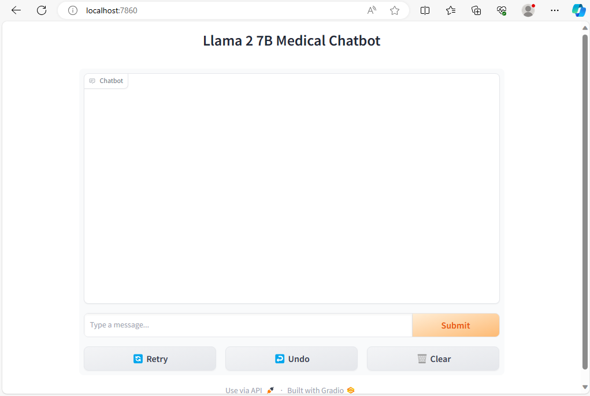

# Llama 2 7b Chatbot

This document states the steps to run the gradio chatbot with
your fine-tuned model, or with a model from HuggingFace.

## Table of Contents:

* [Requirements](#requirements)
  * [Software Requirements](#software-requirements)
  * [Hardware Requirements](#hardware-requirements)
* [Steps To Start the Chatbot](#steps-to-start-the-chatbot)
  * [Configure the Chatbot](#configure-the-chatbot)
    * [Environment Variable Configuration](#environment-variable-configuration)
    * [YAML File Configuration](#yaml-file-configuration)
    * [In-Depth Explanation of `TRAINING_DIR` and `model_path`](#in-depth-explanation-on-training_dir-and-model_path)
  * [Starting the Container](#starting-the-container)
  * [Accessing the Chatbot](#accessing-the-chatbot)
* [How It Works](#how-it-works)


## Requirements:

### Software Requirements:

* [Ubuntu 22.04](https://ubuntu.com/server/docs/installation)
* [Docker](https://docs.docker.com/get-docker/)

### Hardware Requirements:

* [Nvidia GPU](https://www.nvidia.com/en-in/data-center/products/) (that has been setup)
* [Dell PowerEdge servers](https://www.dell.com/en-in/work/shop/servers-storage-and-networking/sf/poweredge?hve=explore+poweredge)

## Steps To Start the Chatbot

### Configure the Chatbot:

There are 2 configuration files: `.env` and `src/config.yml`.

#### Environment Variable Configuration

The following table shows the configuration for the `.env` file:

```bash
TRAINING_DIR=./
```

If a HuggingFace model is desired, `TRAINING_DIR` should be set to `./`.

In case a custom model is to be loaded from a local directory, look at the
[in-depth explanation below](#in-depth-explanation-of-trainingdir-and-modelpath)

#### YAML File Configuration

We have provided a config file, `config.yml`, through which changes to the
configuration can be made. The following
is an example configuration file:

```yaml
chatbot_args:
  model_path: "meta-llama/Llama-2-7b-hf"
  max_new_tokens: 500
  max_padding_length: 4096
  data_type: "torch.bfloat16"
  port: 7860
other_args:
  hf_token: ""
```

The following are the configurations options
that are currently accepted for `chatbot_args`

| Name | Description | Accepted values | Default value |
| --- | --- | --- | --- |
| model_path | The path to the model checkpoint directory relative to the `TRAINING_DIR`. A more [in-depth explanation](#in-depth-explanation-of-trainingdir-and-modelpath) is provided above. | Any valid path | `"meta-llama/Llama-2-7b-hf"` |
| max_new_tokens | The maximum number of new tokens the model can produce | `uint` | `500` |
| max_padding_length | The maximum padding length of the input | `uint` | `4096` |
| port | The port on which to run the chatbot | `0-65535` | `7860` |
| data_type | The `torch` data type that the model should use when running | `"torch.float32"`, `"torch.float16"`, `"torch.bfloat16"`, `"auto"` | `"torch.bfloat16"` |


The following are the configuration options that are currently accepted for `other_args`:

| Name | Description | Accepted values | Default value |
| --- | --- | --- | --- |
| hf_token | Your HuggingFace token. This is only used if you want to use a model from a gated repo, such as if you want to download one of the Llama 2 models. | `str` | `""` |


#### In-Depth explanation on `TRAINING_DIR` and `model_path`

Consider the following example:

I want to load a custom model from a local directory. The directory is
located at `/home/user/distributed_training/training/run1/checkpoint1`.

Here, the directory that contains the model files is `checkpoint1`. Then,
`TRAINING_DIR` can be set to any directory that contains `checkpoint1`,
and `model_path` will be set as the remaining path.

As an example, if you want to set
`TRAINING_DIR=/home/user/distributed_training/`, then you can set
`model_path: "training/run1/checkpoint1"`.

### Starting the Container:

You can simultaneously build and start the container using the following command

```bash
sudo docker compose up --build -d
```

### Accessing the Chatbot:

After the container has been started, you can access the chatbot on port that
you specified in the configuration file. For example, if you specified the port
`12345`, you can access the chatbot by accessing the url `localhost:12345` on a
browser of your choice.

The following is a screenshot of the chatbot:




## How It Works:

When the container is started, it automatically starts the chatbot script,
named `chatbot.py`. This script first reads the configuration file, named
`config.yml`. If the `hf_token` variable is not an empty string, the
token is added for use.

Then, it passes the `model_path` to a conversion script `sft2bin.py`, which
will first copy the files to a new directory, and then convert the files.
If the initial `model_path` directory is not found, it will return without
doing anything.

The `chatbot.py` script then uses path provided by `sft2bin.py`, and the
other configuration options provided in `config.yml` to
load the model. It then starts the chatbot on the specified port.

When you send a message to the chatbot, the chatbot will stream the answer,
using HuggingFace `TextIteratorStreamer` class. The message that was sent
to the chatbot, the chatbot's answer, the time taken to get the answer from
the chatbot, and the tokens per second of the answer will all be recorded in
the `src/app.log` file.
