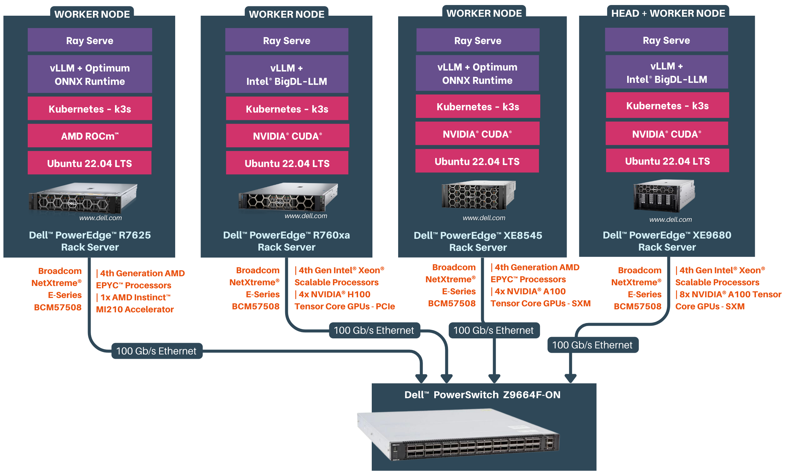

# Distributed Inference for Large Language Models: Embracing Heterogeneous Hardware

Serve Llama 2 (7B/13B/70B) Large Language Models efficiently at scale by leveraging heterogeneous Dell™ PowerEdge™ Rack servers in a distributed manner.

The developer documentation provides a comprehensive guide for serving [Llama 2 Large Language Models (LLMs)](https://llama.meta.com/llama2) in a distributed environment, using [Dell™ PowerEdge™ Rack servers](https://www.dell.com/en-in/work/shop/dell-poweredge-servers/sc/servers) networked with [Broadcom® Ethernet Network Adapters](https://www.broadcom.com/products/ethernet-connectivity/network-adapters). This document aims to empower developers with the knowledge and tools necessary to serve LLMs for maximum inference performance by creating GPU and CPU clusters . By leveraging the computational power of [Dell™ PowerEdge™ Rack servers](https://www.dell.com/en-in/work/shop/dell-poweredge-servers/sc/servers), networking capability of [Broadcom® Ethernet Network Adapters](https://www.broadcom.com/products/ethernet-connectivity/network-adapters) and the scalability with Kubernetes, developers can efficiently serve LLMs to meet their application requirements.

  

## Prerequisites

### Software Requirements

Before we start, make sure you have the following software components set up on your Dell™ PowerEdge™ Rack servers:

* Ubuntu Server 22.04, with kernel v5.15 or higher
* [Docker v24.0 or later](https://docs.docker.com/engine/install/ubuntu/)
* [NVIDIA® CUDA® Toolkit v12.2.1](https://docs.nvidia.com/cuda/cuda-toolkit-release-notes/index.html)
* [AMD ROCm™ v5.7.1](https://www.amd.com/en/products/software/rocm.html)

### Hardware Requirements

Additionally, ensure you have the following hardware components at your disposal:

* [Dell™ PowerEdge™ Rack Servers](https://www.dell.com/en-in/work/shop/dell-poweredge-servers/sc/servers) equipped with [NVIDIA® GPUs](https://www.nvidia.com/en-in/data-center/data-center-gpus/) / [AMD GPUs](https://www.amd.com/en/solutions/data-center/data-center-ai-premiere.html).
* [Broadcom® Ethernet Network Adapters](https://www.broadcom.com/products/ethernet-connectivity/network-adapters)
* [Dell™ PowerSwitch Z9664F-ON](https://www.dell.com/en-in/work/shop/ipovw/networking-z-series)

The solution was tested with the below hardware stack

| Server | CPU | RAM | Disk | GPU |
| --- | --- | --- | --- | --- |
| Dell™ PowerEdge™ XE9680 | Intel® Xeon® Platinum 8480+ | 2 TB | 3TB | 8xNVIDIA® A100 Tensor Core 80GB SXM GPUs |
| Dell™ PowerEdge™ XE8545 | AMD EPYC™ 7763 64-Core Processor | 1 TB | 2 TB | 4xNVIDIA® A100 Tensor Core 80GB SXM GPUs |
| Dell™ PowerEdge™ R760xa | Intel® Xeon® Platinum 8480+ | 1 TB | 1 TB | 4xNVIDIA® H100 Tensor Core 80GB PCIe GPUs |
| Dell™ PowerEdge™ R7625 | AMD EPYC™ 9354 32-Core Processor | 1.5 TB | 1 TB | 1xAMD Instinct™ MI210 Accelerator GPU |

## Deployment Guide
### 1. Setting up a Distributed Cluster

*Estimated Time: 40 mins ⏱️*

To set the stage for distributed inferencing, we'll start by configuring our cluster with precision. Using [Kubernetes](./docs/cluster_setup.md#k3s-setup-on-server-and-agent-nodes) as our orchestration system, we'll establish a cluster comprising of a designated [server/head node](./docs/cluster_setup.md#server-node-setup) and multiple [agent/worker nodes](./docs/cluster_setup.md#agent-node-setup). The flexibility lies in your hands: you can choose to include the head node in the distributed inferencing process or opt for an additional worker node on the same machine as the head node, enhancing the power of your computational setup.

To optimize our resources further, we'll integrate [NVIDIA® device plugins for Kubernetes](./docs/cluster_setup.md#nvidia®-device-plugins-for-kubernetes)  and [AMD device plugins for Kubernetes](./docs/cluster_setup.md#amd-device-plugins-for-kubernetes) using [Helm](./docs/cluster_setup.md#installing-helm).

This streamlined integration ensures that our distributed inferencing environment is equipped with the necessary acceleration capabilities.

Get started with setting up your [distributed cluster](./docs/cluster_setup.md) by following steps.

* [K3S Setup on Server and Agent Nodes](./docs/cluster_setup.md#k3s-setup-on-server-and-agent-nodes)
* [Installing Helm](./docs/cluster_setup.md#installing-helm)
* [NVIDIA® Device Plugins for Kubernetes](./docs/cluster_setup.md#nvidia®-device-plugins-for-kubernetes)
* [AMD Device Plugins for Kubernetes](./docs/cluster_setup.md#amd-device-plugins-for-kubernetes)

### 2. KubeRay Installation and Kubernetes Secrets

*Estimated Time: 10 mins ⏱️*

We'll be introducing [KubeRay](./docs/kuberay_setup.md#kuberay-installation) to our Kubernetes cluster and configure a [Kubernetes secret](./docs/kuberay_setup.md#creating-image-pull-secret-for-kubernetes) for handling inference docker images. This step guarantees a robust and scalable infrastructure for our distributed inference.

* [KubeRay Installation](./docs/kuberay_setup.md#kuberay-installation)
* [Creating Kubernetes Secrets](./docs/kuberay_setup.md#creating-image-pull-secret-for-kubernetes)

## 3. Serving the LLM Models

*Estimated Time: 1hr ⏱️*

We will be executing the distributed inference of the cutting-edge [Llama 2 70B](./docs/serving_llm.md#serving-llm-models) model developed by Meta AI. To accomplish this, we're harnessing the power of robust tool [Ray Serve](https://github.com/ray-project/ray) and [inference backends optimized](./docs/serving_llm.md#inference-serving-optimizations) for the available hardware cluster, ensuring an efficient and scalable workflow.

Let's deploy the Llama 2 models on your cluster for distributed inference.

* [Inference Serving Optimizations](./docs/serving_llm.md#inference-serving-optimizations)
* [Serving Llama 2 70B Chat on GPUs](./docs/serving_llm.md#serving-llama-2-70b-chat-on-gpus)
    * [Building Serving Docker Images](./docs/serving_llm.md#building-serving-docker-images)
    * [Deployment Configuration](./docs/serving_llm.md#deployment-configuration)
    * [Deploying LLama 2 70B Serving](./docs/serving_llm.md#deploying-llama-2-70b-serving)
* [Serving Llama 2 7B Chat on CPUs](./docs/serving_llm.md#serving-llama-2-7b-chat-on-cpus)
    * [Building Serving Docker Images](./docs/serving_llm.md#building-serving-docker-images-1)
    * [Deployment Configuration](./docs/serving_llm.md#deployment-configuration-1)
    * [Deploying LLama 2 7B Serving](./docs/serving_llm.md#deploying-llama-2-7b-serving)

## 4. Monitoring Cluster and Serving

The [Ray Dashboard](./docs/dashboards.md#accessing-the-ray-dashboard) offers real-time insights into serving. Accessible at http://127.0.0.1:30265, this dashboard grants you access to the **Serve** tab, allowing you to monitor serve applications deployed and its logs. Meanwhile, the **Cluster** tab provides a comprehensive overview of device statistics across your cluster, ensuring you're always in control.

The [Grafana Dashboard](./docs/dashboards.md#accessing-grafana-dashboards) empowers you with comprehensive system and cluster metrics. Every dashboard provides in-depth insights into [Kubernetes cluster](./docs/dashboards.md#accessing-the-cluster-level-dashboards) and [Node-level metrics](./docs/dashboards.md#accessing-the-node-level-dashboards), offering a seamless way to monitor and troubleshoot your nodes and deployments.

Dive into [monitoring your cluster](./docs/dashboards.md).

* [Accessing the Ray Dashboard](./docs/dashboards.md#accessing-the-ray-dashboard)
* [Accessing the Grafana Dashboard](./docs/dashboards.md#accessing-the-grafana-dashboard)

## 5. Running Inference with Chatbot

Use the application end point to [run a chatbot](./serving/chatbot/README.md) using Gradio.

## Further Reading

To gain a comprehensive understanding of every facet involved in serving a Large Language Model (LLM), explore the following resources:

| Resource               | Link        |
| ---------------------- | ---------------------------- |
| Llama 2 LLM Model     | [Meta AI-Llama 2 Page](https://llama.meta.com/llama2)   [Llama 2 Research Paper](https://ai.meta.com/research/publications/llama-2-open-foundation-and-fine-tuned-chat-models/) |
| Ray Serve | [Ray Serve GitHub repo](https://github.com/ray-project/ray/)|
| Ray Service | [Ray Service Documentation](https://docs.ray.io/en/master/cluster/kubernetes/getting-started/rayservice-quick-start.html) |
| vLLM | [vLLM GitHub](https://github.com/vllm-project/vllm) |
| Intel BigDL | [BigDL GitHub](https://github.com/intel-analytics/BigDL) |
| Optimum ONNXRuntime | [HuggingFace Optimum ONNX Runtime](https://huggingface.co/docs/optimum/v1.2.1/en/onnxruntime/modeling_ort)  [ONNX Runtime](https://github.com/microsoft/onnxruntime)  [Optimum ONNXRuntime GitHub](https://github.com/huggingface/optimum) |
