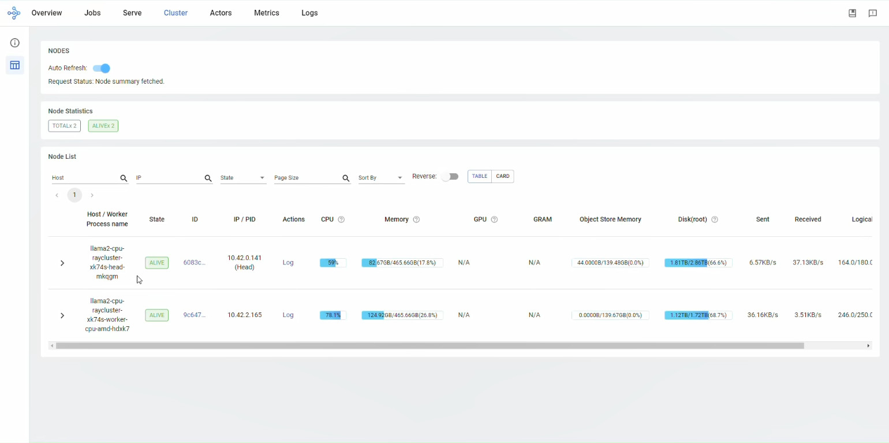
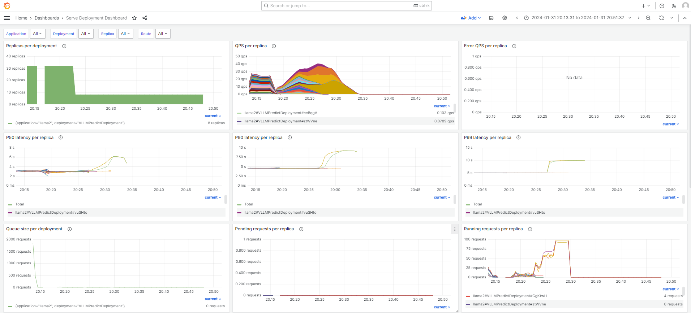
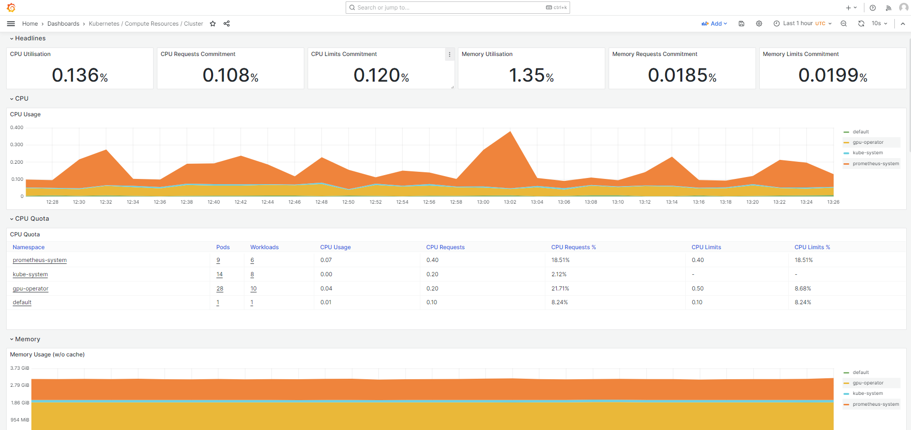

# Dashboards

You can access all details regarding your cluster and serving deployment through dashboards.

## Table of Contents

* [Accessing the Ray Dashboard](#accessing-the-ray-dashboard)
* [Accessing the Grafana Dashboard](#accessing-the-grafana-dashboard)
    * [Deploying Monitoring Stack](#deploying-monitoring-stack)
    * [Accessing the Cluster level Dashboards](#accessing-the-cluster-level-dashboards)
    * [Accessing the Node level Dashboards](#accessing-the-node-level-dashboards)

## Accessing the Ray Dashboard

Ray provides a web-based [Ray Dashboard](https://docs.ray.io/en/latest/ray-observability/getting-started.html) for monitoring and debugging Ray Cluster. The visual representation of the system state allows users to track the performance of the cluster and troubleshoot issues.

1. Once all the cluster pods are running, the ray cluster dashboard is accessible at the `SERVER_IP:30265`(eg, 127.0.0.1:30265).

    <details>
      <summary>Configuring Ray dashboard port</summary>

      The Ray dashboard can be configured to be accesible at any ports ranging from `30000` to `32767`. The current setup enables the Kubernetes NodePort at `30265`.

      To change the port,

      1. Modify the `nodePort` value of `kind: Service` - `ports: name: dashboard`.

          ```yaml
          ...
          kind: Service
          metadata:
            name: ray-head-dashboard-port
          spec:
            selector:
              name: ray-gpu-head
            type: NodePort
            ports:
            - port: 8265
              name: "dashboard"
              targetPort: 8265
              nodePort: 32765 # Update the ray dashboard port here
          ...
          ```
      2. Apply the changes using `kubectl`.

          ```sh
          kubctl apply -f cluster.yml
          ```

      > [!TIP]
      > Refer [Ray Cluster Configuration | Cluster Services](./ray_cluster.md#cluster-services) to know more about configuring Kubernetes services.
      </details>

2. The **Cluster** section provides the details of all the nodes connected to the cluster.

    
    <figcaption style="text-align:justify; font-style:italic;">Fig 3. Cluster Section of the Ray Dashboard showing details of the cluster. </figcaption>

## Accessing the Grafana Dashboard

### Deploying Monitoring Stack

The monitoring stack utilized Prometheus-Grafana for collecting and dashboarding the metrics.

Follow the below steps to enable monitoring stack on your cluster.

> [!NOTE]
> This documentation is an adapted version of [Ray - Using Prometheus and Grafana doc](https://docs.ray.io/en/latest/cluster/kubernetes/k8s-ecosystem/prometheus-grafana.html#kuberay-prometheus-grafana)

1. Clone the [ray-project/kuberay](https://github.com/ray-project/kuberay) repository and switch branch to `v1.0.0`.

    ```sh
    git clone https://github.com/ray-project/kuberay.git
    cd kuberay
    git checkout v1.0.0
    ```
2. Modify the file [install/prometheus/overrides.yaml](https://github.com/ray-project/kuberay/blob/v1.0.0/install/prometheus/overrides.yaml) to add NVIDIA®  GPU metrics config. Update the `additionalScrapeConfigs` under `prometheus` -> `prometheusSpec` on Line 3247.

    ```yaml
    additionalScrapeConfigs:
      - job_name: gpu-metrics
        scrape_interval: 1s
        metrics_path: /metrics
        scheme: http
        kubernetes_sd_configs:
        - role: endpoints
          namespaces:
            names:
            - gpu-operator
        relabel_configs:
        - source_labels: [__meta_kubernetes_pod_node_name]
          action: replace
          target_label: kubernetes_node
        - source_labels: [__meta_kubernetes_pod_host_ip]
          action: replace
          target_label: instance
    ```
  3. Install the prometheus-grafana stack  on `prometheus-system` namespace.
      ```sh
      ./install/prometheus/install.sh
      ```
  4. Verify the installations
      ```sh
      kubectl get po -n prometheus-system -o wide
      ```

> [!TIP]
> To know more about additional configurations refer [Ray - Using Prometheus and Grafana documentation](https://docs.ray.io/en/latest/cluster/kubernetes/k8s-ecosystem/prometheus-grafana.html#kuberay-prometheus-grafana)

> [!TIP]
> This Prometheus stack enables only NVIDIA® GPU metrics. To enable the AMD GPU metrics refer [AMD SMI Prometheus Exporter](https://github.com/amd/amd_smi_exporter).


### Accessing Grafana Dashboards

The Grafana dashboards can be accessed by enabling port forwarding to 3000 from the cluster.

1. Forward the port of the Grafana

    ```sh
    kubectl port-forward --address 0.0.0.0 deployment/prometheus-grafana -n prometheus-system 3000:3000
    ```
2. Login to the Grafana dashboard at `SERVER_IP:3000`(eg, 127.0.0.1:3000) using credentials `admin` and `prom-operator`

  <details>
  <summary>Accessing the Prometheus Web UI</summary>

  To access the Prometheus web UI, follow the below steps

  1. Forward the port of the Prometheus Web UI

      ```sh
      kubectl port-forward --address 0.0.0.0 prometheus-prometheus-kube-prometheus-prometheus-0 -n prometheus-system 9090:9090
      ```
  2. Access the web UI at `SERVER_IP:3000`(eg, 127.0.0.1:3000).
  </details>

#### Accessing the Cluster level Dashboards

* The cluster level dashboard is accessible at `Dashboard` -> `Kubernetes / Computer Resources / Cluster`.

    
    <figcaption style="text-align:justify; font-style:italic;"> Serve Deployment Dashboard. </figcaption>
    <br>

* The Ray Serve deployment dashboard is accessible at `Dashboards` -> `Serve Deployment Dashboard`.

    
    <figcaption style="text-align:justify; font-style:italic;">Kubernetes Cluster Dashboard. </figcaption>

### Accessing the Node level Dashboards

  The Node level dashboard provides insights into the system hardware utilizations.

  To enable the node level dashboard, follow the below steps

  1. Create the Node dashboard by clicking `Dashboards` icon in the left panel -> `New` -> `Import` -> `Upload JSON file` and choose the [`dashboards/node_dashboard.json`](../dashboards/node_dashboard.json) file. And click `Import`.
  2. Once created the dashboard is accessible at `Dashboards` -> `Nodes`

      
      <figcaption style="text-align:justify; font-style:italic;"> Node level Dashboard. </figcaption>

  3. Configuring Node Dashboard

      The Node dashboard needs to be configured to reflect nodes on your cluster.

      Each panel on the dashboard reads data from the Prometheus datasource. For example, the panel  `GPU Compute Utilization` for `Node 1: XE9680` query is as below

      ```sql
      sum(DCGM_FI_DEV_GPU_UTIL{instance="192.168.1.112"})/count (DCGM_FI_DEV_GPU_UTIL{Hostname="xe9680"})
      ```

      The `{instance="192.168.1.112"}` and `Hostname="xe9680"` is used to select the specific taget cluster node.

      Update the details according to your cluster configuration for all panels similarly. (Refer Prometheus metrics for the labels allocated for each nodes.)

[Back to Deployment Guide](../README.md#deployment-guide)
