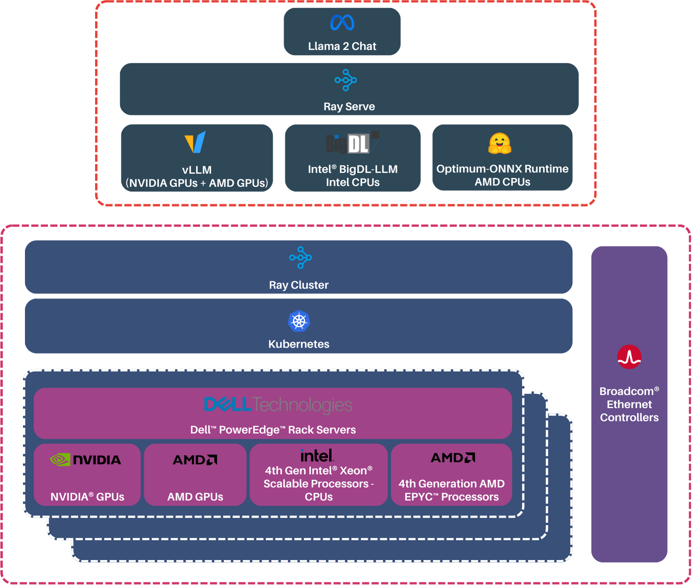
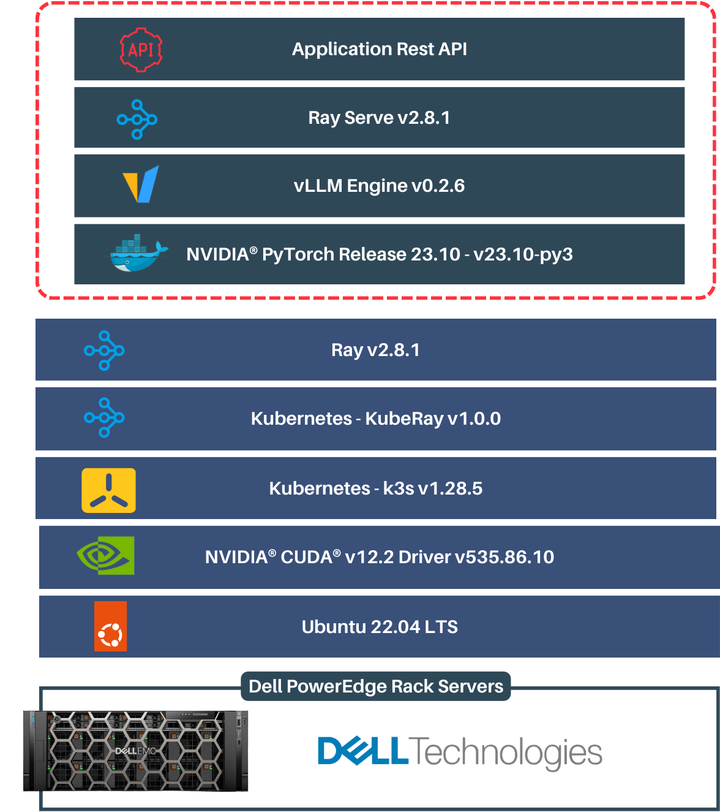
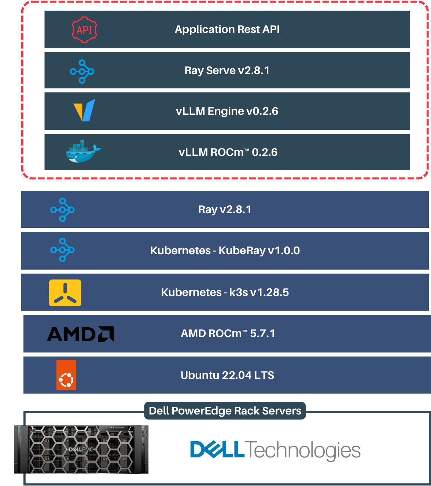
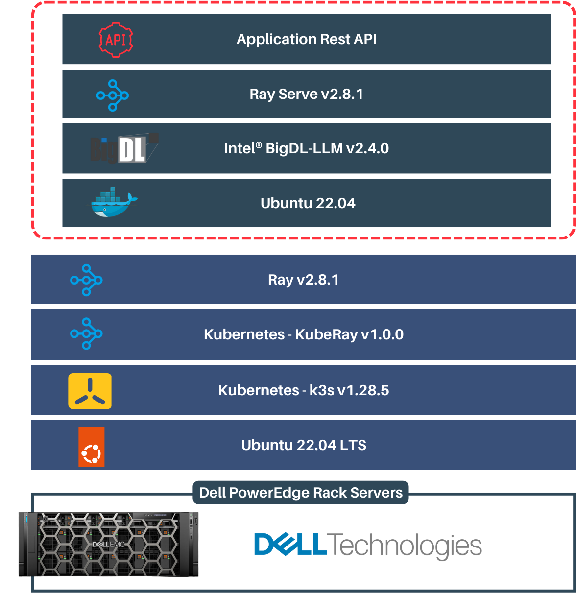
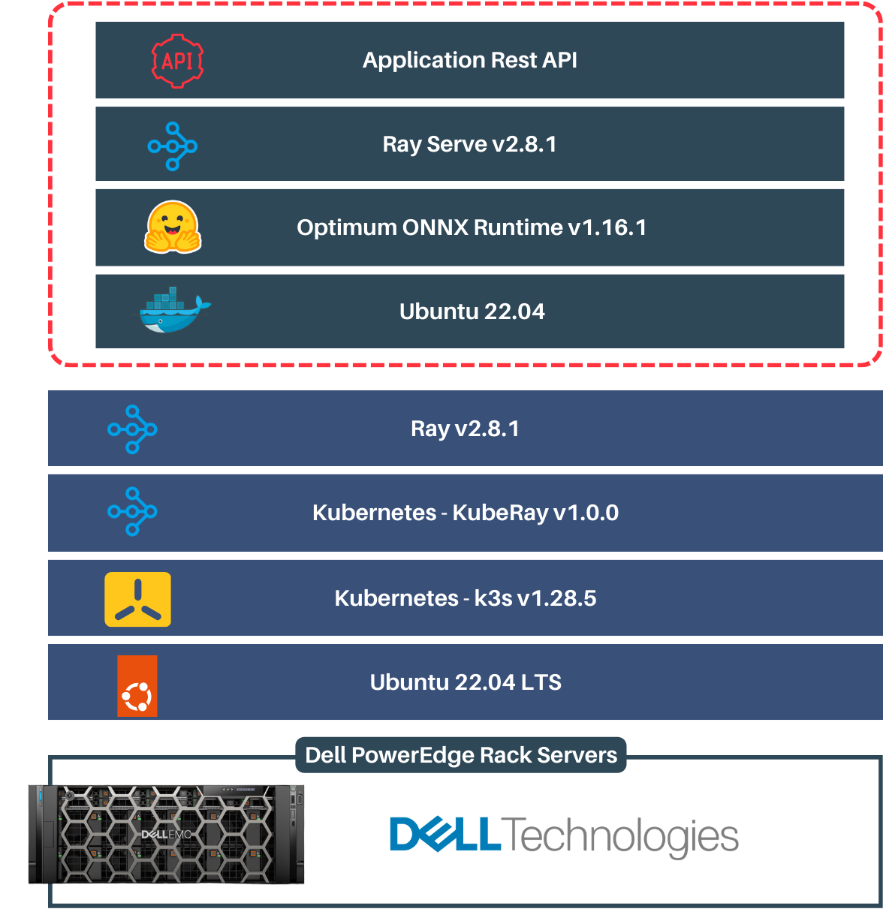

# Inference Serving Optimizations

Optimized libraries enable the functionality of running inference on each hardware.

The below section offers deeper insights into optimized libraries utilized for each hardware.

* [NVIDIA® GPUs](#nvidia®-gpus)
* [AMD GPUs](#amd-gpus)
* [Intel® CPUs](#intel®-cpus)
* [AMD CPUs](#amd-gpus)

## NVIDIA® GPUs

The NVIDIA® GPUs inference is enabled by [vLLM](https://github.com/vllm-project/vllm) (v0.2.6).

The Ray Serve is integrated with vLLM asynchronous engine.
vLLM is a high-throughput and memory-efficient inference and serving engine for Large Language Models (LLMs). vLLM provides efficient management of attention key and value memory with PagedAttention and  continuous batching of incoming requests. It supports seamless integration with popular HuggingFace models and offers high-throughput inference.

## AMD GPUs

The AMD GPUs inference is enabled by [vLLM-ROCm](https://github.com/vllm-project/vllm) (v0.2.6).

vLLM ensures fast model execution with AMD ROCm™ (HIP graph), and when combined with Ray Serve, vLLM can be used to create a scalable service for fast and scalable LLM serving.

## Intel® CPUs

The Intel® CPUs inference is enabled by [BigDL-LLM](https://github.com/intel-analytics/BigDL) (v2.4.0)

BigDL-LLM is a library developed by Intel® Analytics which can accelerate LLMs using low-precision (INT4/INT5/INT8) techniques, modern hardware accelerations, and the latest software optimizations. It can run any Hugging Face Transformers PyTorch model with minimal code changes, resulting in significant speedup.

## AMD CPUs

The AMD CPU Inference is enabled by [Optimum ONNX Runtime](https://huggingface.co/docs/optimum/main/en/onnxruntime/overview) (v1.16.1)

Optimum is a library developed by Hugging Face that provides optimized versions of transformer models, which are designed to provide faster inference times and lower memory usage. ONNX Runtime, on the other hand, is a performance-focused engine for executing machine learning models in the ONNX (Open Neural Network Exchange) format. Combining Optimum and ONNX Runtime can result in significantly improved inference times and reduced memory usage for transformer models.

[Back to Deployment Guide](../README.md#deployment-guide)
