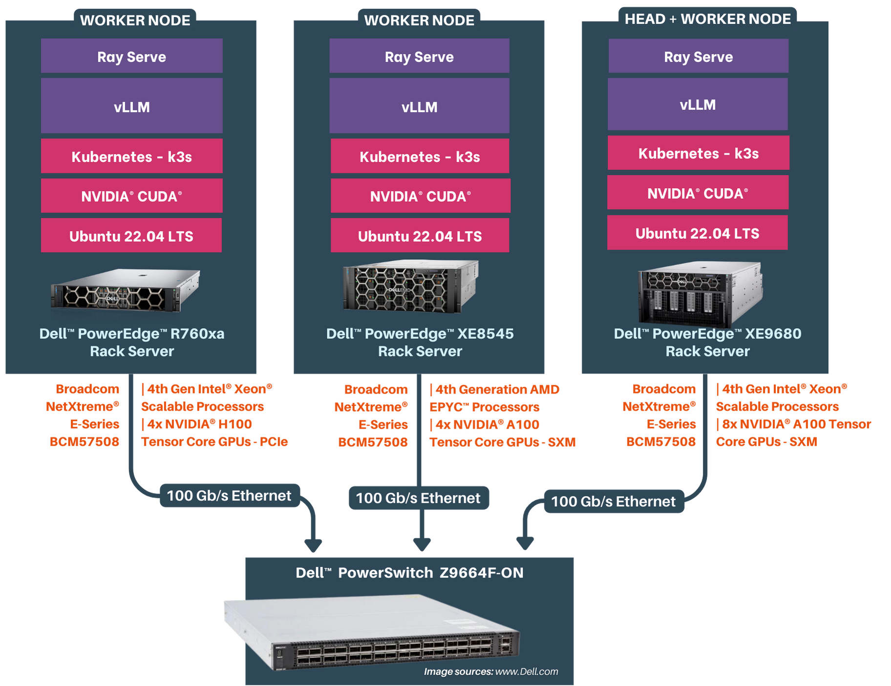
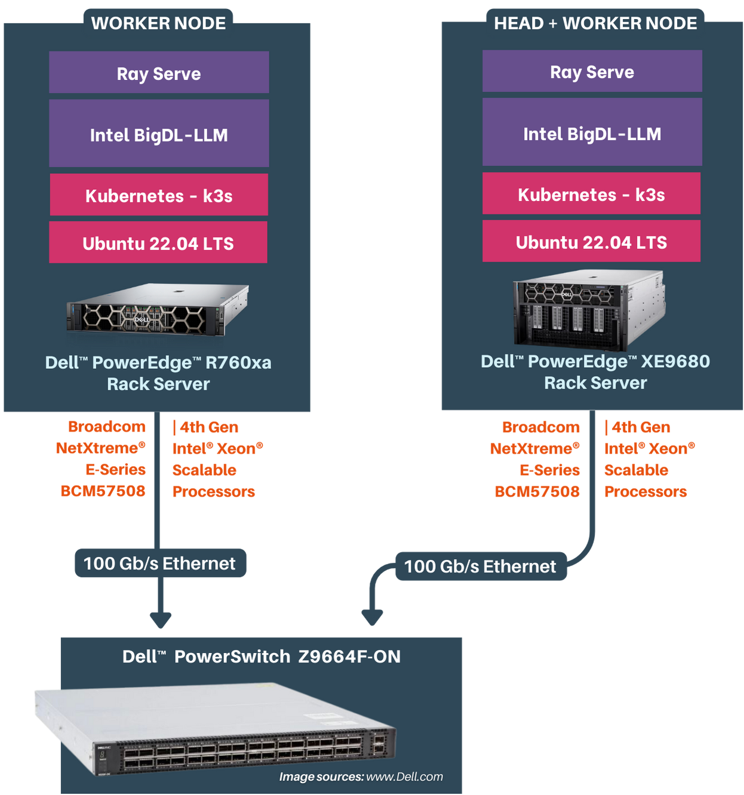

# Performance Testing for Distributed Inferencing

## Table of Contents

* [Introduction](#1-introduction)
    * [Objective](#11-objective)
    * [Scope](#12-scope)
* [Performance Testing on GPU](#2-performance-testing-on-gpu)
    * [Test Environment](#21-test-environment)
        * [Hardware Configuration](#211-hardware-configuration)
        * [Software Configuration](#212-software-configuration)
    * [Test Scenarios](#22-test-scenarios)
        * [Single node inferencing](#221-single-node-inferencing)
        * [Two node inferencing](#222-two-node-inferencing)
        * [Three node inferencing](#223-three-node-inferencing)
    * [Test Workload Configuration](#23-test-workload-configuration)
    * [Test Metrics](#24-test-metrics)
    * [Performance Metrics](#25-performance-metrics)
        * [Scalability results for batch size of 32 per replica](#251-scalability-results-for-batch-size-of-32-per-replica)
        * [Scalability results for batch size of 256 per replica](#252-scalability-results-for-batch-size-of-256-per-replica)
* [Performance Testing on CPU](#3-performance-testing-on-cpu)
    * [Test Environment](#31-test-environment)
        * [Hardware Configuration](#311-hardware-configuration)
        * [Software Configuration](#312-software-configuration)
    * [Test Scenarios](#32-test-scenarios)
        * [Single node inferencing](#321-single-node-inferencing)
        * [Two node inferencing](#322-two-node-scenario)
    * [Test Workload Configuration](#33-test-workload-configuration)
    * [Test Metrics](#34-test-metrics)
    * [Performance Reports](#35-performance-reports)

## 1. Introduction

Scalers AI has developed an LLM Distributed Inferencing solution that emphasizes simultaneous support for diverse large language models, compatibility with multiple backends, and a hardware-agnostic design. This versatile solution allows users to efficiently deploy various models within a unified environment, optimizing performance based on specific requirements and hardware platforms.

### 1.1 Objective

* Evaluate the scalability of user initiated LLM inference requests with respect to scaling the nodes on the distributed inferencing cluster.
* Measure resource utilization under different concurrent user inferencing scenarios.

### 1.2 Scope

This methodology covers the testing of inferencing capabilities, resource utilization, and overall system performance of LLM models distributed across multiple nodes on Kubernetes environment.

## 2. Performance Testing on GPU

### 2.1 Test Environment

#### 2.1.1 Hardware Configuration

The Kubernetes cluster configuration used for the testing is as shown below

The cluster consists of three Dell™ PowerEdge™ Rack servers
| Server | CPU | RAM | Disk | GPU |
| --- | --- | --- | --- | --- |
| Dell™ PowerEdge™ XE9680 | Intel® Xeon® Platinum 8480+ | 2 TB | 3TB | 8xNVIDIA® A100 Tensor Core 80GB SXM GPUs |
| Dell™ PowerEdge™ XE8545 | AMD EPYC™ 7763 64-Core Processor | 1 TB | 2 TB | 4xNVIDIA® A100 Tensor Core 80GB SXM GPUs |
| Dell™ PowerEdge™ R760xa | Intel® Xeon® Platinum 8480+ | 1 TB | 1 TB | 4xNVIDIA® H100 Tensor Core 80GB PCIe GPUs |

Each server is networked to a Dell™ PowerSwitch Z9664F-ON through Broadcom NetXtreme® E-Series BCM57508 NICs with 100 Gb/s bandwidth.

#### 2.1.2 Software Configuration

##### Kubernetes + Ray Cluster
| Software | Version |
| --- | ---- |
| [K3s](https://github.com/k3s-io/k3s/) | `v1.28.5+k3s1` |
| [Helm](https://github.com/helm/helm) | `v3.12.3` |
| [KubeRay](https://github.com/ray-project/kuberay) | `1.0.0` |
| [NVIDIA® GPU Operator Kubernetes](https://docs.nvidia.com/datacenter/cloud-native/gpu-operator/latest/getting-started.html#operator-install-guide) | `v23.9.1` |

##### Distributed Inference Docker Image
| Software | Version |
| --- | ---- |
| [Ray](https://github.com/ray-project/ray) | `2.8.1` |
| [Ray Serve](https://github.com/ray-project/ray) | `2.8.1` |
| [NVIDIA® NGC PyTorch Image](https://catalog.ngc.nvidia.com/orgs/nvidia/containers/pytorch) | `23.10-py3` |
| [vLLM](https://github.com/vllm-project/vllm) | `0.2.6` |
| [GPUtil](https://github.com/anderskm/gputil) | `1.4.0` |

##### Testing Stack
| Software | Version |
| --- | ---- |
| [Locust](https://github.com/locustio/locust) | `2.20.0` |

##### Large Language Model

| Model | Precision |
| --- | --- |
| [Llama 2 70B Chat HF](https://huggingface.co/meta-llama/Llama-2-70b-chat-hf) | `bfloat16` |

### 2.2 Test Scenarios

The Llama 2 70B Chat HF model is loaded with a tensor parallelism of 4 GPUs. A 70B model (Float 32 precision) requires ~260 GB of GPU memory to load the model. Based on the model weight GPU memory requirement and inference requirements, we recommend using 4x80GB GPUs to load a single Llama 2 70B Chat model.

We will be running the Llama 2 70B Chat model with bfloat16 precision for the tests.

#### 2.2.1 Single Node Inferencing

The below table describes the single node inferencing hardware configuration with 4 GPUs (1 replica).

| Device | Node Type | GPU | GPU Count | CPU Cores |  Memory | Disk |
| --- | --- | --- | --- |--- |--- | --- |
| Dell™ PowerEdge™ XE9680 | Head | - | - | 160 | 300 GB | 1 TB |
| Dell™ PowerEdge™ XE8545 | Worker | NVIDIA® A100 Tensor Core 80GB SXM | 4 | 160 | 300 GB | 1 TB |

#### 2.2.2 Two Node Inferencing

Two scenarios for two node inferencing

##### Scenario  1: 8 GPUs, 2 Replicas

The below table describes the two node inferencing hardware configuration with 8 GPUs(2 replicas).

| Device | Node Type | GPU | GPU Count | CPU Cores |  Memory | Disk |
| --- | --- | --- | --- |--- |--- | --- |
| Dell™ PowerEdge™ XE9680 | Head | NVIDIA® A100 Tensor Core 80GB SXM | 4 | 160 | 300 GB | 1 TB |
| Dell™ PowerEdge™ XE8545 | Worker | NVIDIA® A100 Tensor Core 80GB SXM | 4 | 160 | 300 GB | 1 TB |

##### Scenario  2: 12 GPUs, 3 Replicas

The below table describes the two node inferencing hardware configuration with 12 GPUs(3 replicas).

| Device | Node Type | GPU | GPU Count | CPU Cores |  Memory | Disk |
| --- | --- | --- | --- |--- |--- | --- |
| Dell™ PowerEdge™ XE9680 | Head+Worker | NVIDIA® A100 Tensor Core 80GB SXM | 8 | 160 | 300 GB | 1 TB |
| Dell™ PowerEdge™ XE8545 | Worker | NVIDIA® A100 Tensor Core 80GB SXM | 4 | 160 | 300 GB | 1 TB |

#### 2.2.3 Three Node Inferencing

The below table describes the two node inferencing hardware configuration with 16 GPUs(4 replicas).

| Device | Node Type | GPU | GPU Count | CPU Cores |  Memory | Disk |
| --- | --- | --- | --- |--- |--- | --- |
| Dell™ PowerEdge™ XE9680 | Head+Worker | NVIDIA® A100 Tensor Core 80GB SXM | 8 | 160 | 300 GB | 1 TB |
| Dell™ PowerEdge™ XE8545 | Worker | NVIDIA® A100 Tensor Core 80GB SXM | 4 | 160 | 300 GB | 1 TB |
| Dell™ PowerEdge™ R760xa | Worker | NVIDIA® H100 Tensor Core 80GB PCIe | 4 | 160 | 300 GB | 1 TB |

### 2.3 Test Workload Configuration

The workload consists of a set of 1000+ prompts passed randomly for each test with different concurrent requests. The concurrent requests are generated by locust tool.

The inference configuration is as below
* Input token length: 14 to 40
* Output token length: 256
* Temperature: 1

The tests were run with two different batch sizes per replica - 32 and 256.

### 2.4 Test Metrics

The below are the metrics measured for each tests

| Metric | Explanation |
| -- | ---- |
| Requests Per Second (RPS)| Evaluate system throughput, measuring requests processed per second. |
| Total Token Throughput (tokens/s) | Quantify language model efficiency by assessing token processing rate. |
| Request Latency (P50, P95, P99) | Gauge system responsiveness through different latency percentiles. |
| Average CPU, Memory, GPU Utilization | Assess system resource usage, including CPU, memory, and GPU. |
| Network Bandwidth (Average, Maximum) | Measure efficiency in data transfer with average and maximum network bandwidth. |

### 2.5 Performance Metrics

#### 2.5.1 Scalability results for batch size of 32 per replica

| Inference Nodes | Devices | GPUs | Concurrent Requests |RPS | Tokens/s | P95 Latency(s) | P95 Token Latency(ms) |
| --- | --- | ---| --- | --- | ---| --- | --- |
| Single Node | Dell™ PowerEdge™ XE8545 | 4xNVIDIA® A100 Tensor Core 80GB SXM | 32 | 2.7 | 621.4 | 13 | 50.78 |
| Two Nodes | Dell™ PowerEdge™ XE9680(4 GPUs)   Dell™ PowerEdge™ XE8545 | 8xNVIDIA® A100 Tensor Core 80GB SXM | 64 | 4.8 | 1172.63 | 17 | 66.41 |
| Two Nodes | Dell™ PowerEdge™ XE9680   Dell PowerEdge XE8545 | 12xNVIDIA® A100 Tensor Core 80GB SXM | 96 | 6.8 | 1551.94 | 17 | 66.4 |
| Three Nodes | Dell™ PowerEdge™ XE9680   Dell™ PowerEdge™ XE8545   Dell™ PowerEdge™ R760xa | 12xNVIDIA® A100 Tensor Core 80GB SXM   4xNVIDIA® H100 Tensor Core 80GB PCIe | 128 | 8.3 | 1868.76 | 17 | 66.4 |

#### 2.5.2 Scalability results for batch size of 256 per replica

| Inference Nodes | Devices | GPUs | Concurrent Requests |RPS | Tokens/s | P95 Latency(s) | P95 Token Latency(ms) |
| --- | --- | ---| --- | --- | ---| --- | --- |
| Single Node | Dell™ PowerEdge™ XE8545 | 4xNVIDIA® A100 Tensor Core 80GB SXM | 256 | 6.4 | 1475.64 | 45 | 175.78 |
| Two Nodes | Dell™ PowerEdge™ XE9680(4 GPUs)   Dell™ PowerEdge™ XE8545 | 8xNVIDIA® A100 Tensor Core 80GB SXM | 512 | 10.3 | 2542.32 | 61 | 238.28 |
| Two Nodes | Dell™ PowerEdge™ XE9680   Dell™ PowerEdge™ XE8545 | 12xNVIDIA® A100 Tensor Core 80GB SXM | 768 | 14.5 | 3222.89 | 64 | 250 |
| Three Nodes | Dell™ PowerEdge™ XE9680   Dell™ PowerEdge™ XE8545   Dell™ PowerEdge™ R760xa | 12xNVIDIA® A100 Tensor Core 80GB SXM   4xNVIDIA® H100 Tensor Core 80GB PCIe 80GB | 1024 | 17.5 | 4443.5 | 103 | 402.35 |

## 3. Performance Testing on CPU

### 3.1 Test Environment

#### 3.1.1 Hardware Configuration

The Kubernetes cluster configuration used for the testing is as shown below

The cluster consists of two Dell™ PowerEdge™ servers

|Server | CPU | RAM | Disk |
| --- | --- | --- | --- |
| Dell™ PowerEdge™ XE9680 | Intel® Xeon® Platinum 8480+ | 2 TB | 3 TB |
| Dell™ PowerEdge™ R760xa | Intel® Xeon® Platinum 8480+ | 1 TB | 1 TB |

Each server is networked to a Dell™ PowerSwitch Z9664F-ON through Broadcom NetXtreme® E-Series BCM57508  NICs with 100 Gb/s bandwidth.

#### 3.1.2 Software Configuration

##### Kubernetes + Ray Cluster
| Software | Version |
| --- | ---- |
| [K3s](https://github.com/k3s-io/k3s/) | `v1.28.5+k3s1` |
| [Helm](https://github.com/helm/helm) | `v3.12.3` |
| [KubeRay](https://github.com/ray-project/kuberay) | `1.0.0` |

##### Distributed Inference Docker Image
| Software | Version |
| --- | ---- |
| [Ray](https://github.com/ray-project/ray) | `2.8.1` |
| [Ray Serve](https://github.com/ray-project/ray) | `2.8.1` |
| [Ubuntu Image](https://hub.docker.com/_/ubuntu) | `22.04` |
| [BigDL-LLM](https://github.com/intel-analytics/BigDL) | `2.4.0` |

##### Testing Stack
| Software | Version |
| --- | ---- |
| [Locust](https://github.com/locustio/locust) | `2.20.0` |

##### Large Language Model

| Model | Precision |
| --- | --- |
| [Llama 2 7B Chat HF](https://huggingface.co/meta-llama/Llama-2-7b-chat-hf) | `bfloat16` |

### 3.2 Test Scenarios

The Llama 2 7B Chat HF model is tested on Intel® Xeon® Platinum 8480+ CPUs with int8 precision.

#### 3.2.1 Single Node Inferencing

Three are two scenarios for single node inferencing

##### Scenario 1: 112 Cores, 1 Replicas

The below table describes the single node inferencing kubernetes deployment configuration with 112 CPU Cores of Dell™ PowerEdge™ R760xa Rack server (1 replica).

| Device                | Node Type | CPU Cores | Memory | Disk  |
|-----------------------|-----------|-----------|--------|-------|
| Dell™ PowerEdge™ XE9680 | Head      | -         | 500 GB | 1 TB  |
| Dell™ PowerEdge™ R760xa | Worker    | 112       | 500 GB | 1 TB  |

##### Scenario 2: 224 Cores, 2 Replicas

The below table describes the single node inferencing kubernetes deployment configuration with 224 CPU Cores of Dell™ PowerEdge™ R760xa Rack server  (2 replicas).

| Device                | Node Type | CPU Cores | Memory | Disk  |
|-----------------------|-----------|-----------|--------|-------|
| Dell™ PowerEdge™ XE9680 | Head      | 10        | 500 GB | 1 TB  |
| Dell™ PowerEdge™ R760xa | Worker    | 224       | 500 GB | 1 TB  |

#### 3.2.2 Two Node Scenario
The below table describes the two node inferencing hardware configuration with both the servers, 448 Cores of CPU (4 replicas).

| Device                | Node Type | CPU Cores | Memory | Disk  |
|-----------------------|-----------|-----------|--------|-------|
| Dell™ PowerEdge™ XE9680 | Head      | 224       | 500 GB | 1 TB  |
| Dell™ PowerEdge™ R760xa | Worker    | 224       | 500 GB | 1 TB  |

### 3.3 Test Workload Configuration

The workload consists of a set of 1000+ prompts passed randomly for each test with different concurrent requests. The concurrent requests are generated by Locust tool.

The inference configuration is as below
* Input token length: 14 to 40
* Output token length: 256
* Temperature: 1

The tests were run with 1 batch size per replica.

### 3.4 Test Metrics

The below are the metrics measured for each tests

| Metric                         | Explanation                                                   |
|--------------------------------|---------------------------------------------------------------|
| Requests Per Second (RPS)       | Evaluate system throughput, measuring requests processed per second.  |
| Total Token Throughput (tokens/s) | Quantify language model efficiency by assessing token processing rate. |
| Request Latency (P50, P95, P99) | Gauge system responsiveness through different latency percentiles.   |
| Average CPU, Memory            | Assess system resource usage, including CPU, memory.             |
| Network Bandwidth (Average, Maximum) | Measure efficiency in data transfer with average and maximum network bandwidth. |

### 3.5 Performance Reports

The scalability results are as follows:

| Inference Nodes | Devices                          | CPU Cores                           | Concurrent Requests | RPS   | Throughput (Tokens/s) | P95 Latency (s) | P95 Token Latency (ms) |
|------------------|----------------------------------|-------------------------------------|----------------------|-------|------------------------|-----------------|------------------------|
| Single Node      | Dell™ PowerEdge™ R760xa            | Intel® Xeon®  Platinum 8480+ (112 Cores) | 1                    | 0.1   | 17.18                  | 18              | 70.31                  |
| Single Node      | Dell™ PowerEdge™ R760xa            | Intel® Xeon®  Platinum 8480+ (224 Cores) | 2                    | 0.1   | 30.26                  | 21              | 82.03                  |
| Two Nodes        | Dell™ PowerEdge™ XE9680, Dell™ PowerEdge™ R760xa    | Intel® Xeon®  Platinum 8480+ (448 Cores) | 4                    | 0.3   | 61.13                  | 23              | 89.84                  |

**Performance varies by use case, model, application, hardware & software configurations, the quality of the resolution of the input data, and other factors. This performance testing is intended for informational purposes and not intended to be a guarantee of actual performance of an LLM inference application.*
