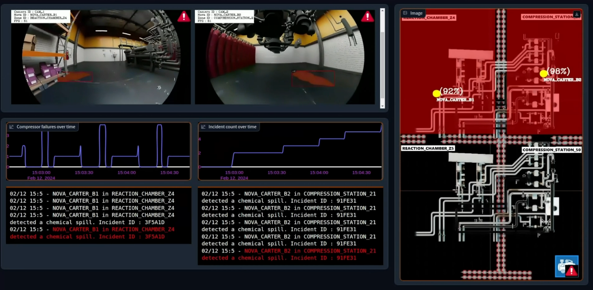

# Industrial Metaverse

The Industrial Metaverse project demonstrates a simulated oil rig environment where autonomous mobile robots (AMRs) perform inspections and hazard detection. The solution leverages NVIDIA® Isaac Sim™ for realistic simulation, synthetic data generation (with NVIDIA® Omniverse® Replicator and Isaac Sim™) to boost AI model accuracy, and a real-time chemical spill detection pipeline built on NVIDIA® DeepStream. Additionally, it simulates an industrial compressor system to detect bearing faults using sensor data and a custom trained ML model, enabling predictive maintenance. A centralized dashboard offers a unified view of AMR video feeds, spill alerts, robot positions, and compressor health, facilitating comprehensive factory floor monitoring and incident management.


Snapshot Metaverse dashboard and Centralized Factory Console dashboard views.

> To know about the solution design refer the [design guide](./docs/design.md).

## Prerequisites

## Hardware Requirements

* [Dell™ PowerEdge™ Rack Servers](https://www.dell.com/en-in/work/shop/dell-poweredge-servers/sc/servers) equipped with multiple [NVIDIA® L40S GPUs](https://www.nvidia.com/en-in/data-center/l40s/).
* [Broadcom® Ethernet Network Adapters](https://www.broadcom.com/products/ethernet-connectivity/network-adapters)
* [Dell™ PowerSwitch Z9664F-ON](https://www.dell.com/en-in/work/shop/ipovw/networking-z-series) (Optional)

### Software Requirements

Before we start, make sure you have the following software components set up on your Dell™ PowerEdge™ Rack servers:

* Ubuntu Server 22.04, with kernel v5.15 or later
* [Docker v24.0 or later](https://docs.docker.com/engine/install/ubuntu/)
* [NVIDIA® CUDA® Toolkit v12.2.1 or later](https://docs.nvidia.com/cuda/cuda-toolkit-release-notes/index.html)
* [Nvidia Docker Container Toolkit](https://docs.nvidia.com/datacenter/cloud-native/container-toolkit/latest/install-guide.html)


<details>
<summary>The solution was tested with the below hardware stack.</summary>

| Server | CPU | RAM | Disk | GPUs |
| --- | --- | --- | --- | ---- |
| Dell™ PowerEdge™ R760xa | Intel® Xeon® Platinum 8592+ | 500 GB | 500 GB | 4xNVIDIA® L40S GPUs |
| Dell™ PowerEdge™ R760xa | Intel® Xeon® Platinum 8470Q | 500 GB | 1 TB |  |

</details>

## Deployment Guide

### Deploying Factory Simulation

Let's start with deploying the Factory Simulation environment on [NVIDIA® Isaac Sim™](https://developer.nvidia.com/isaac-sim) with an RTSP Simulator to publish Autonomous Mobile Robots (AMR) camera streams.

The simulated factory floor creates a chemical factory environment with few chemical spills placed at specific location and two AMRs moving around in designated zones for the inspection and reporting.

#### Starting RTSP Server

Start the RTSP server to enable the NVIDIA® Isaac Sim™ application to stream AMR camera frames.

1. After cloning the repo on your machine, navigate to [industrial_metaverse/rtsp_server](./industrial_metaverse/rtsp_server) directory on the repo.

    ```sh
    cd industrial_metaverse/rtsp_server/
    ```

2. Install the git-lfs and ffmpeg on the server.

    ```sh
    sudo apt-get update
    sudo apt-get install git-lfs ffmpeg
    ```

3. Pull the git lfs files.

    ```sh
    git lfs pull
    ```

4. Start the RTSP Server service to handle streams from metaverse simulation.

    ```sh
    sudo docker compose up --build -d
    ```

<details>
<summary>Advance RTSP Simulator Configurations(Optional)</summary>

This module also includes as RTSP publisher module. The module reads any mp4 video files available on the [industrial_metaverse/rtsp_server/sample_videos](./industrial_metaverse/rtsp_server/sample_videos/) directory and publishes them as RTSP endpoint over the RTSP server deployed.

To enable this functionality, copy the video files to the `sample_videos` directory and restart the `video_publisher` service.

```sh
cd industrial_metaverse/rtsp_server/
sudo docker compose restart video_publisher
```

</details>

#### Deploying Factory Demo on NVIDIA® Isaac Sim™

First complete the installation of the NVIDIA® Isaac Sim™ on NVIDIA® Omniverse launcher.

1. Follow the instruction on [NVIDIA® Omniverse](https://www.nvidia.com/en-in/omniverse/download/) download page and setup the launcher on your workstation.
2. Once the NVIDIA® Omniverse launcher installation is complete, install [NVIDIA® Isaac Sim™](https://docs.omniverse.nvidia.com/isaacsim/latest/installation/install_workstation.html).

> [!NOTE]
> The solution was tested on NVIDIA® Isaac Sim™ version 2023.1.1.

> [!NOTE]
> Follow the default installation steps for NVIDIA® Isaac Sim™.

Once the installation is complete, let's deploy the factory demo on NVIDIA® Isaac Sim™.

> [!NOTE]
> Run the below commands on a desktop environment.

1. Create the `ISAAC_SIM_PACKAGE` environment variable for enabling seamless execution of the setups steps.

    ```sh
    export ISAAC_SIM_PACKAGE=<installed isaac sim directory>
    ```

    The below command displays the installed isaac sim directory name,

    ```sh
    ls /home/$USER/.local/share/ov/pkg/
    ```

    For e.g. `isaac_sim-2023.1.1`

2. Change directory to [industrial_metaverse/factory_demo](./industrial_metaverse/factory_demo/)
3. Run the below command to start the factory demo.

    ```sh
    bash deploy.sh
    ```

    > NVIDIA® Isaac Sim™ will be loaded on first GPU.

3. Once it is fully loaded you can click on the **Isaac Examples** tab in the menu and click on **Factory Demo**. Once you see a small pop up of **Factory Demo** window in on the screen, click on **Load**.

    > Start up might take longer depending on your network speed.

4. On the NVIDIA® Isaac Sim™ window, Click on the **Play** button on the left navigation panel to start the simulation.

> [!TIP]
> Default perspective view could be occluded when the simulation is launched. To navigate around the Factory Demo simulation refer [Accessing Metaverse Dashboard](#accessing-metaverse-dashboard) steps.

<details>
<summary>Advance Factory Demo Configuration(Optional)</summary>

The factory demo on NVIDIA® Isaac Sim™ can be configured by updating the [industrial_metaverse/config/metaverse_config.yaml](./industrial_metaverse/config/metaverse_config.yaml) file.

You can configure two types of parameters for the factory demo on the  `metaverse_config.yml`.

1. AMR Configurations (`robot_config`)

    The AMR configuration supported are described below

    | Configuration | Description | Example |
    | ---- | ---- | ---- |
    | `url` | RTSP endpoint to stream AMR view camera streams. | `rtsp://localhost:8554/amr1` |
    | `robot_name` | AMR name on the NVIDIA® Isaac Sim™ view. | `CarterNav1` |
    | `camera_name` | Name of the camera configured on the AMR | `AMRCam1` |

2. AMR movement zone configuration

    The factory demo consists of two AMRs moving in four designed zones inside the chemical factory. Zone names can be configured under [`zone_config`](./industrial_metaverse/config/metaverse_config.yaml#L24).

</details>

> [!TIP]
> Refer [Isaac Sim Advanced](./docs/isaac_sim_advanced.md) to know more.

### Deploying Bearing Fault Detection

A Compressor system with multiple devices are simulated on the solution. Multiple sensor values are collected from each device at regular intervals. Collected sensor data are published over OPC UA for further analysis. The sensor data will be collected by the bearing analytics module which analyses the data to detect any faults with any devices.

Follow the below steps to deploy the bearing fault detection modules

1. Change directory to `industrial_metaverse/bearing_fault_detection` directory on the repo.
2. Deploy the OPC UA server module.

    ```sh
    sudo docker compose --file opcua_server/docker-compose.yml --project-directory opcua_server/ up --build -d
    ```

3. Deploy the bearing data simulator module.

    ```sh
    sudo docker compose --file bearing_simulator/docker-compose.yml --project-directory bearing_simulator/ up --build -d
    ```

4. Deploy the bearing analytics to start analysing the bearing simulator data.

    ```sh
    sudo docker compose --file bearing_analytics/docker-compose.yml --project-directory bearing_analytics/ up --build -d
    ```

### Deploying Chemical Spill Detection Pipeline

The hazardous chemical spills are detected and segmented out by the chemical spill detection pipeline. The pipeline utilizes the [YOLOv8](https://github.com/ultralytics/ultralytics) segmentation model fine tuned for the chemical spill.

The fine-tuning process involves collecting training data from the simulated chemical factory. The [NVIDIA® Omniverse™ Replicator](https://developer.nvidia.com/omniverse/replicator) was leveraged to automate the dataset creation.

<details>
<summary>More about Synthetic Dataset Creation with NVIDIA® Omniverse™ Replicator</summary>

The NVIDIA® Omniverse™ Replicator extension along with NVIDIA® Isaac Sim™ provides an automated way of creating custom dataset from the simulated factory environment.

For creating the synthetic dataset for training the chemical spill segmentation model, the below variations were introduced the factory demo environment using NVIDIA® Omniverse™ Replicator.

* Types of chemical spill
* Location of the chemical spill on the factory floor
* Lighting of the factory floor
* Environment of the factory

Once the synthetic dataset is created, the YOLOv8s segmentation model is trained by leveraging the NVIDIA® L40S on the Dell™ PowerEdge™ Rack Server. The training resulted with a model of 95% test data accuracy (0.95 mAP)  with a single class.

> [!TIP]
> Refer [Using Replicator For Transfer Learning](./docs/transfer_learning.md) to know more.

</details>

Follow the below steps to deploy the chemical spill segmentation pipeline with custom trained YOLOv8 model.

1. Change directory to [industrial_metaverse/chemical_spill_pipeline](./industrial_metaverse/chemical_spill_pipeline/)

2. Start the pipeline service.

    ```sh
    sudo docker compose up --build -d
    ```

<details>
<summary>Advanced Configurations(Optional)</summary>

The chemical spill detection pipeline can be configured by updating the [industrial_metaverse/config/metaverse_config.yaml](./industrial_metaverse/config/metaverse_config.yaml) file.

You can configure two types of parameters for the pipeline on the  `metaverse_config.yml` file.

1. Single vs multi device deployment.

    The [`deploy_single`](./industrial_metaverse/config/metaverse_config.yaml#L3) parameters controls deployment scenario.

    * `true` (default): Enables the pipeline to encode the post processed video streams on the GPU and streaming over UDP endpoints.
    * `false`: Multi device deployment scenario where the visualization     stack is deployed on the second server. Raw streams will be published over Zenoh endpoints by the pipeline.

2. Pipeline input and metadata configurations

    The below tables describes the configurations supported by the pipeline for each AMRs under `robot_config`.

    | Configuration | Description | Example |
    | ---- | ---- | ---- |
    | `url`| Input RTSP streams for the chemical spill segmentation. <br> This can be configured to received stream from either NVIDIA® Isaac Sim™ or simulated video streams over RTSP. | `rtsp://localhost:8554/amr1` |
    | `broker` | Zenoh broker IP. Supported: <br> * `localhost`: Single device deployment scenario. <br> * Visualization machine 100 Gbps NIC IP: Multi device deployment scenario. | `localhost`(default) |
    | `spill_topic` | Zenoh topic to publish spill detection metadata. | `cam1` |
    | `udp_port` | UDP endpoint port to stream encoded output streams. | `1234` |

</details>

### Deploying Visualization Services

The visualization services enabled the functionalities of the Centralized factory console dashboard.

<details>
<summary>Configuring Multi Device Deployment(Optional)</summary>

The visualization services can be deployed on a different server. The multi device deployment enable the user of 100 Gbps NICs to transfer uncompressed video streams from the chemical spill detection pipeline to the visualization service through Zenoh.

To configure the multi device deployment, update the following configurations.

#### Chemical spill detection pipeline configuration

The chemical spill detection pipeline needs to configured with updating the below variables enable the pipeline to support multi device deployment.

* `deploy_single` to `false`
* `broker` for each `robot_config` with IP of the 100 Gbps NIC of the second server.

Refer the **Advanced Configuration** under the [Deploying Chemical Spill Detection Pipeline](#deploying-chemical-spill-detection-pipeline) section to know more.

Once the configurations are applied, restart the chemical spill detection pipeline service.

1. Change directory to [industrial_metaverse/chemical_spill_pipeline](./industrial_metaverse/chemical_spill_pipeline/)

2. Restart the chemical spill detection pipeline service.

    ```sh
    sudo docker compose restart
    ```

#### Configure the visualization services

Update the below configuration under [industrial_metaverse/visualization/.env](./industrial_metaverse/visualization/.env) file to enable multi device for the visualization services.

| Variable | Description |
| ---  |----  |
| `SERVER_IP` | IP of the 100 Gbps NIC on the second server. |
| `DASHBOARD_IP` | IP of the machine running the visualization services. |

</details>

Follow the below steps to deploy the services.

1. Change directory to [industrial_metaverse/visualization](./industrial_metaverse/visualization) directory.
2. Start the services.

    ```sh
    sudo docker compose up --build -d
    ```

### Accessing Metaverse Dashboard

The factory demo application deployed on NVIDIA® Isaac Sim™ provides a detailed view of a chemical factory with Autonomous Mobile Robots (AMRs) doing regular inspection to detect and report hazards. The simulated hazardous environment contains chemical spills.

The chemical factory floor is divides into 4 zones as defined on [`zone_config` - `metaverse_config.yml`](./industrial_metaverse/config/metaverse_config.yaml#L24). Two NOVA Carter AMRs moves within these zones for the detecting and reporting chemical spill hazards on the factory floor.

The factory floor can be easily navigated between multiple views. Follow the below tips to navigate through the chemical factory environment.

* On the NVIDIA® Isaac Sim™ window, the **ViewPort** window is set on **Perspective** mode by default. This can be changed to access the **Top**, **Right**, **Front** and individual **Camera Views**.
* You can also move around in the NVIDIA® Isaac Sim™ using your mouse. Some tips for navigating within the view are below.

    * Hold down the middle mouse button and moving the mouse will make you move around in the world.
    * Hold down right click and moving around will change the orientation from your current viewing angle.
    * Scrolling in and out will zoom in and out in the simulator.

The below snapshot showcases the **Perspective** view of the factory demo on NVIDIA® Isaac Sim™.


### Accessing Centralized Factory Console Dashboard

The centralized factory console dashboard comprises the following components:

* AMR Chemical Spill View: Provides a direct feed from AMR cameras, highlighting detected chemical spills in red for immediate visual identification.
* Metaverse Factory Floor Map: Offers a detailed, real-time map of the entire factory floor. AMR locations are updated continuously, along with inspection progress. Zones affected by chemical spills are marked in red.
* Chemical Spill Incident Logs: Maintains a real-time record of chemical spill incidents across all factory floor zones.
* Compressor Sensor Failure Graph: Displays a time-series graph visualizing compressor sensor failures over time, aiding in predictive maintenance analysis.

1. Access the [localhost:7860/?__theme=dark](http://localhost:7860/?__theme=dark) page to load the Centralized Factory Console Dashboard on browser.
2. Once the dashboard page is loaded, click on the **Start Session** button on the video streaming panel after it appears. (The button might take few seconds to appear. )


The below snapshot of the centralized factor console dashboard showcases two Nova Carter AMRs detecting spill in two zones and two incidents being flagged as shown on the incident logs.



## Known Issues

Refer the [Known Issues Documentation](./docs/known_issues.md) to know more.
