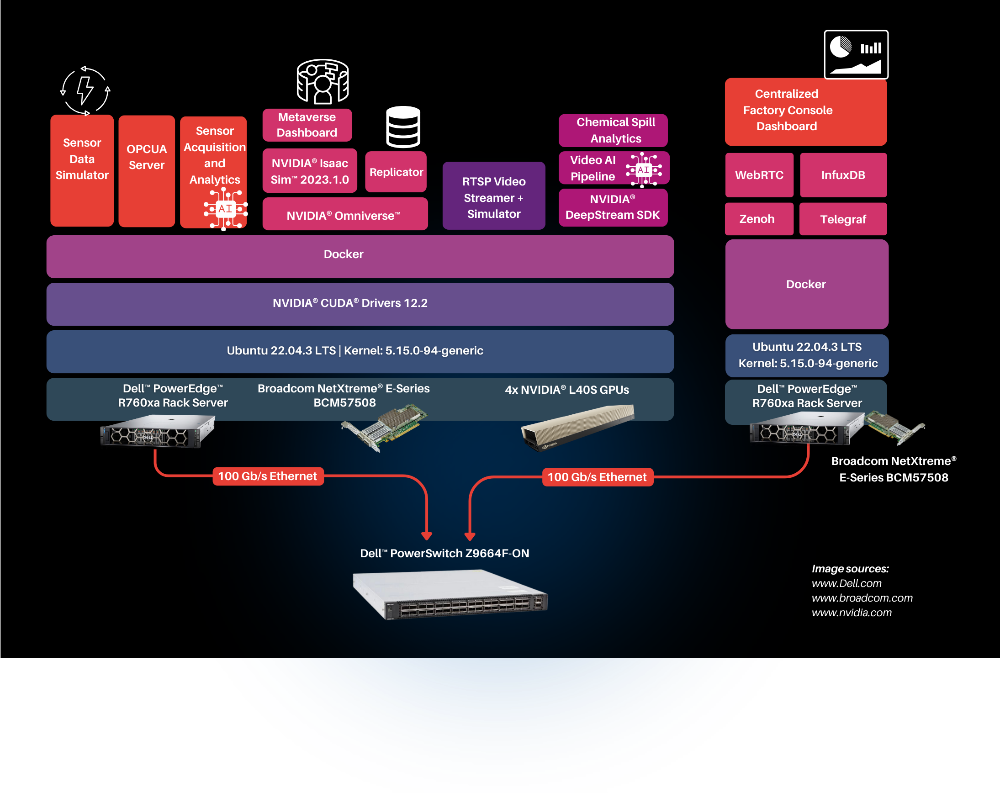

# Industrial Metaverse Design

The Industrial Metaverse solution enables a showcase of an industrial oil rig with multiple Autonomous Mobile Robots (AMR)  inspecting the equipment and factory floors.

The solution consists of the following components

### Industrial Oil Rig Simulation

This simulated environment leverages NVIDIA Isaac Sim to create a highly realistic oil rig with a custom factory floor. It's designed to replicate the complexities of a real industrial setting, with diverse machinery. Two autonomous mobile robots (AMRs), model Nova Carter, are tasked with hazard detection. They carefully inspect the factory floor across four zones, focusing on identifying chemical spills as the primary hazard for this simulation.

AMRs are equipped with fisheye cameras to provide a comprehensive view of their surroundings. These cameras generate RTSP video streams for analysis. Additionally, Zenoh is used to broadcast the AMRs' precise locations within the factory. This combination of real-time video and location data allows for detailed monitoring and analysis of the simulated environment.

### AI Model Enhancement with Synthetic Data

The solution takes advantage of cutting-edge tools like NVIDIA Omniverse Replicator and Isaac Sim to generate synthetic datasets. The goal is to supplement real-world data and improve the performance of AI models when they are deployed in production environments. These synthetic datasets offer the ability to simulate complex and potentially dangerous scenarios that would be difficult or costly to recreate in the real world.

### Chemical Spill Detection Pipeline

Real-time RTSP streams are the focus of the chemical spill detection pipeline, built on NVIDIA DeepStream. The pipeline pinpoints chemical spills and applies a segmentation overlay to visually highlight them. This visual cue aids workers monitoring the situation. Detection events also trigger metadata being published over Zenoh,  enabling integration with other systems for further analysis and response.

The video streams on the pipeline is handles differently for single and multi devices deployment scenarios. In single-device scenarios, where all services run on a single machine, the video stream is GPU-encoded and transmitted over UDP. For multi-device scenarios, where visualization is handled by a separate server connected via a high-speed 100 Gbps network, sending uncompressed video directly to the Centralized Factory Console Dashboard services.

### Industrial Compressor System Bearing Fault Detection

A simulated industrial compressor system integrates multiple sensor-equipped devices, with data transmitted via the OPC-UA protocol.  Bearing sensor data draws from the [Machinery Fault Dataset - Induction Motor Faults Database](https://www.kaggle.com/datasets/uysalserkan/fault-induction-motor-dataset/data)., enabling an MLP Classifier model to identify specific faults (cage, outer race, ball) with approximately 95% accuracy. This pre-trained model drives the bearing analytics service, continuously analyzing OPC-UA data streams from the compressor system. The service detects bearing failures in real-time, triggering appropriate alerts or maintenance actions within the wider factory management system.

### Centralized Visualization and Incident Management

The Centralized Factory Console Dashboard offers a unified view of essential factory floor operations. It seamlessly displays the AMR video feeds, with detected chemical spills marked for instant recognition. A detailed, real-time map of the factory highlights AMR positions, zone status, and any ongoing spill incidents. The dashboard also maintains real-time logs of all chemical spill events and visualizes compressor sensor failure data over time, facilitating predictive maintenance strategies.
