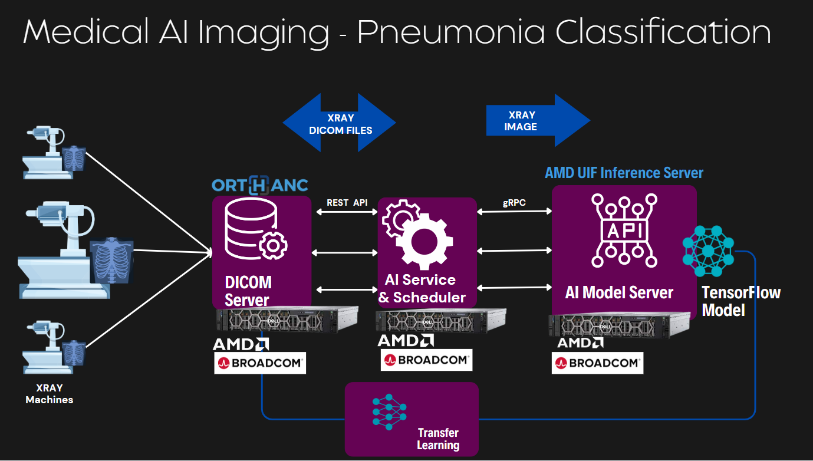
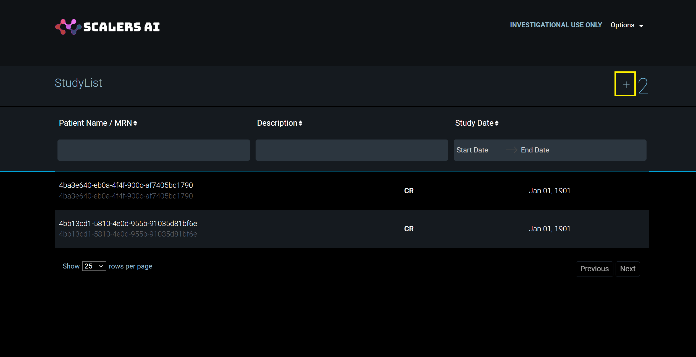
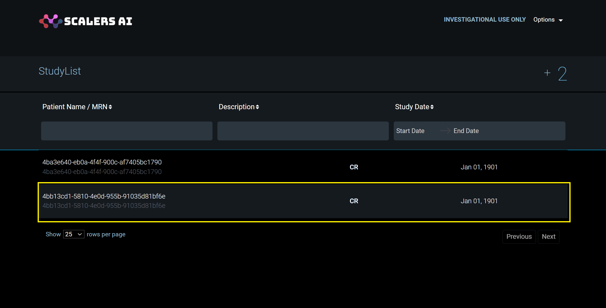
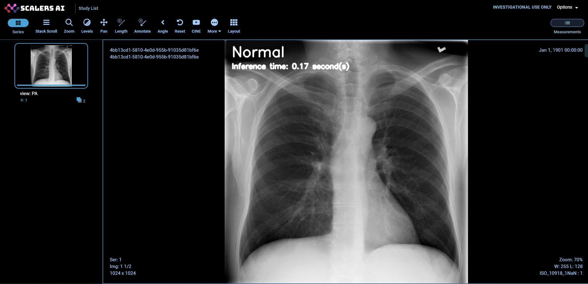

# Medical AI Imaging Solution
AI-powered medical imaging solution for pneumonia detection uses advanced algorithms and machine learning techniques to analyze medical images, such as X-rays or CT scans, to identify signs of pneumonia in patients. This solution help to increase speed and accuracy in diagnosis, reduced chances of human error, and the potential to assist healthcare professionals in handling large volumes of imaging data more efficiently, leading to better patient outcomes.



The Medical AI Imaging solution consists of the following modules
### AMD UIF Inference server
The AMD Inference Server is an open-source tool to deploy your machine learning models and make them accessible to clients for inference. Out-of-the-box, the server can support selected models that run on AMD CPUs
### AI Service & Scheduler
The AI Service & Scheduler automates the analysis of medical images (DICOM) stored in the Orthanc server. It identifies new images, batches them, sends them to an Inference Server for AI analysis, processes the results, and uploads the annotated images back to Orthanc, streamlining and enhancing the diagnostic process.
### Orthanc Server
Orthanc is an open-source, lightweight, and vendor-neutral DICOM server used for the storage and communication of medical imaging data. It acts as a dedicated system for managing and handling medical images in the DICOM (Digital Imaging and Communications in Medicine) format, which includes X-rays, MRIs, CT scans, and other types of medical imaging files.

### OHIF Viewer
The OHIF (Open Health Imaging Foundation) Viewer is an open-source, web-based medical imaging viewer designed to display and interpret various types of medical images, primarily DICOM (Digital Imaging and Communications in Medicine) files. OHIF Viewer is a component of the broader OHIF project, which aims to create open standards and technology for image-based health care research and clinical practice.

### Pneumonia Classification Model Using ResNet50
This reference solution utilizes the ResNet50 model to analyze chest X-ray images obtained from the NIH Clinical Center dataset. Its primary objective is to detect the presence or absence of pneumonia, essentially performing a binary classification. The model was trained using the Xray DICOM dataset from the [NIH Clinical Center dataset](https://www.nih.gov/news-events/news-releases/nih-clinical-center-provides-one-largest-publicly-available-chest-x-ray-datasets-scientific-community), involving transfer learning with the ResNet50 architecture. This training process resulted in training accuracy of 99 percent and a validation accuracy of 85 percent, utilizing FP32 precision.

## Recommended System Requirements
### Hardware
* Edge servers based on AMD EPYC™ processor
* 64 GB RAM
* 500 GB Disk

#### Note:
The solution is tested on Dell PowerEdge R7625


### Software
* Ubuntu 22.04
* [Docker](https://docs.docker.com/engine/install/ubuntu/)

## Medical AI Imaging

### Building Medical AI Imaging solution services

Follow the below steps to build the medical imaging docker images
1. Clone the repo.
2. Change directory to `medical-usecase`.
    ```sh
    cd <repo home>/medical-usecase
    ```
3. Run the below command to start the build.

    ```sh
    sudo docker compose build
    ```
### Running Medical AI Imaging solution services

Follow the below steps to run the Medical AI Imaging solution docker images.
1. Run the below command to start the build.
    ```sh
    sudo docker network create pacs
    sudo docker compose up -d
    ```
2. Once the all the services are running, run the below command to check health of all the services.
    ```sh
    sudo docker compose ps -a
    ```
### Application Dashboard
1. On your deployment machine, open the [`localhost:3000`](http://localhost:3000) to open the OHIF viewer.
2. Use the following credentials to login.
    * Username: `admin`
    * Password: `admin`
3. As shown in the below image, Click on upload button and select DICOM file from file explorer.

    Note: Sample DICOM files are in [samples](./medical-usecase/samples/) directory



4. Select required DICOM to view as shown in the below image.



5. View processed DICOM on OHIF viewer. Scroll over the image to switch between original image and processed image



#### Configuration settings

Update the [medical-usecase/config.yaml](./medical-usecase/config.yaml) file to connect external Orthanc server

| Name | Description |  Default |
| --- | ---- | --- |
| `url` | Orthanc URL | `http://localhost:8042` |
| `username` | Orthanc username | `admin` |
| `password` | Orthanc password | `admin` |
