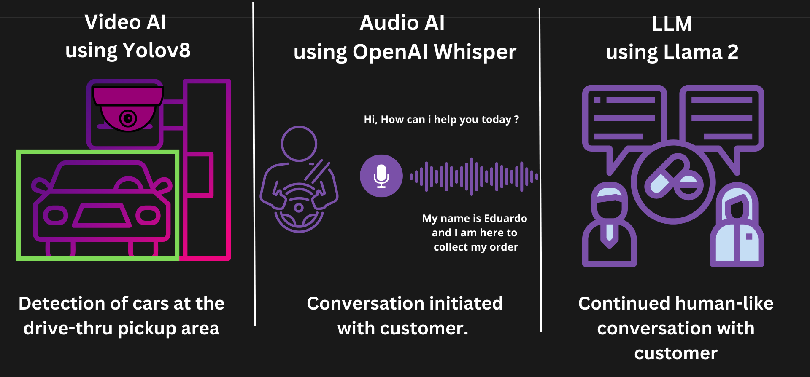
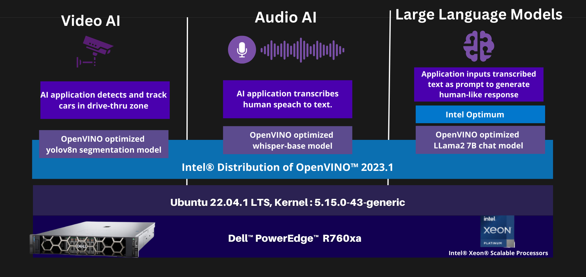
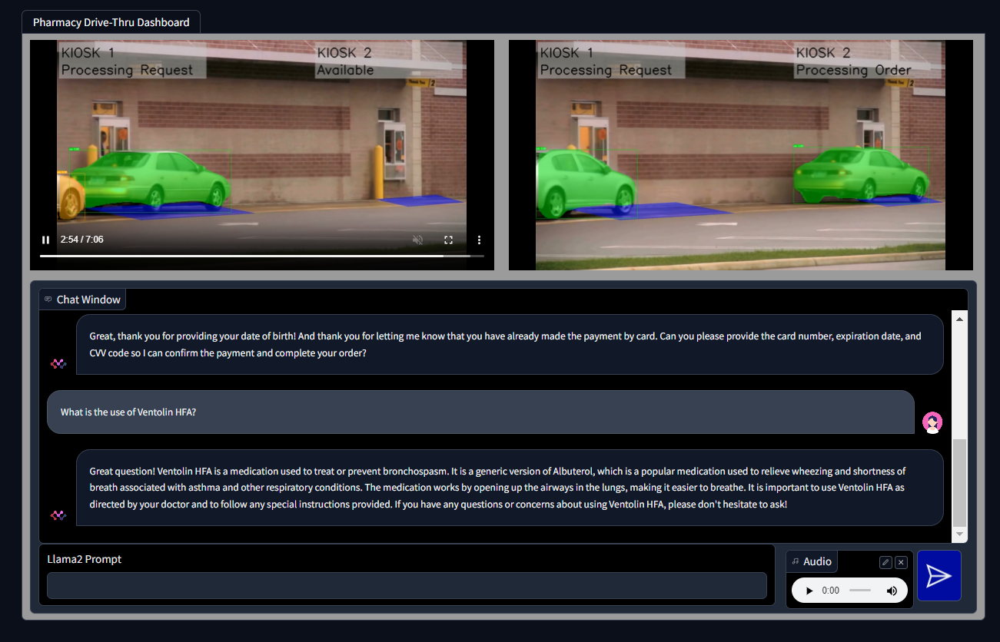

# Pharmacy Drive-Thru Solution

In this innovative use case, we have harnessed the power of three cutting-edge technologies: Whisper for audio analysis, Llama as a language model, and YOLOv8 for computer vision. Together, they create a seamless and automated system designed to facilitate a smooth and hassle-free experience for customers picking up their medications.



## Components



1. Vehicle Detection: YOLOv8, the leading computer vision model, is responsible for monitoring the entrance of a designated zone. When a vehicle, typically a customer's car, enters this zone, YOLOv8 detects it and triggers the next steps.

2. Voice Analysis with Whisper: Once the vehicle is detected, our Whisper audio analysis system springs into action. It listens to what the customer has to say, providing real-time audio transcribed input which is fed to llama.

3. Conversational Interface with Llama: The conversation between the customer and our computer system is facilitated by Llama, a powerful language model. Llama takes the customer's spoken words and processes them, including understanding context about the order details, prescription information, and any specific requirements.

4. Automated Assistance: As Llama processes the customer's input, it reaches a conclusion regarding the necessary steps for the customer to follow in order to pick up their medications. This may include confirming the order, directing the customer to the appropriate location, or providing any additional information required.


This use case represents the future of customer service, where a fully automated system streamlines the interaction between the customer and the service provider. By combining audio analysis, language understanding, and computer vision, we have created an efficient, convenient, and user-friendly experience for medication pickup, ensuring that customers receive the care and attention they need without any unnecessary delays or hassles.


## Prerequisites
- Ubuntu 22.04
- [Docker v24.0.7 or higher](https://docs.docker.com/engine/install/ubuntu/).
- [Llama-2 Model Access](https://huggingface.co/meta-llama/Llama-2-7b-chat-hf)

## Pharmacy Drive-Thru Solution Setup

### Building the solution
1. Clone the repository to your local machine.  

2. Navigate to the `pharmacy-retail-usecase` directory.

3. Update the `.env` file with the Hugging Face token (`HF_TOKEN`) that has Llama2 access and the Host machines IP Address (`HOST_IP`).

4. Build the Docker containers for the application.

    ```sh
    sudo docker compose build
    ```
### Running the solution

1. Start the Docker containers.

    ```sh
    sudo docker compose up -d
    ```

2. Verify that everything is running smoothly by checking the logs.

    ```sh
    sudo docker compose ps -a
    ```

    > Note: In the output when you see the gradio service as healthy is when all the components are loaded successfully and demo setup is complete.

### Accessing the Pharmacy Drive-Thru Dashboard.

1. Open your web browser where docker containers are running and load the following URL: http://localhost:7860/

    