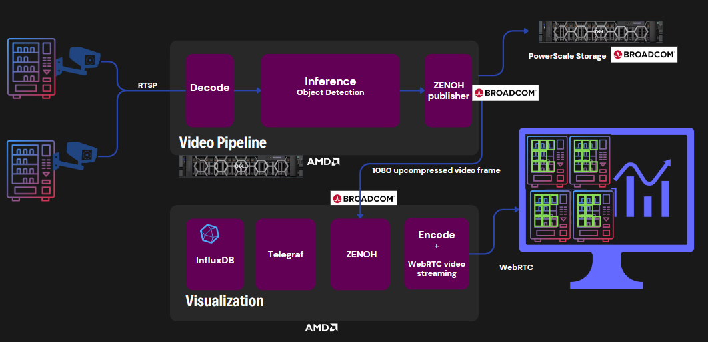

# Retail Inventory Management Reference Solution

## Table of Contents
* [Introduction](#introduction)
* [Recommended System Requirements](#recommended-system-requirements)
    * [Hardware](#hardware)
    * [Software](#software)
* [Retail Inventory Management](#retail-inventory-management)
    * [Building pipeline services](#building-pipeline-services)
    * [Running pipeline services](#running-pipeline-services)
    * [Building visualization services of application](#building-visualization-services-of-application)
    * [Running visualization services](#running-visualization-services)
    * [Application Dashboard](#application-dashboard)

* [Advanced Developer Configurations](#advanced-developer-configurations)

## Introduction
The Retail Inventory Management Reference Solution is a system designed to monitor and manage stock levels on retail shelves through the implementation of an object detection AI model. The AI model employed in this system is capable of identifying and recognizing products on store shelves, enabling automatic inventory counts and precise monitoring of stock levels. By leveraging computer vision and machine learning algorithms, the system can detect when items are running low or out of stock, providing alerts to store personnel for timely restocking or replenishment.
### Architecture Diagram


The Retail Inventory Management Reference Solution consists of the following modules
### Retail stock detection pipeline
Retail stock detection pipeline decodes live camera streams, utilizes object detection AI to identify products on shelves, and post-processes frames to ensure accurate inventory monitoring and management in real time.
* **[Zenoh](https://zenoh.io/)**: Zenoh fosters a flexible and robust framework for communication, data distribution, and collaboration among devices and applications within an IoT, edge computing, or distributed system.
* **[Telegraf](https://www.influxdata.com/time-series-platform/telegraf/)**: Telegraf serves as a versatile and lightweight agent, capable of collecting a wide variety of metrics from diverse sources, processing that data, and sending it to different endpoints for storage, monitoring, or analysis.

* **[InfluxDB](https://www.influxdata.com/)**: InfluxDB is an open-source, high-performance time-series database, designed for efficient storage and retrieval of time-stamped data, commonly used in monitoring, IoT, and DevOps applications for real-time analytics and visualization.

* **Visualization**: Visualization engine helps to stream the processed camera feed to be visualized and streamed directly over the web using WebRTC, enabling remote viewing, analysis

* **Model Details**
This reference solution leverages the SSD_MobileNet_V2 model to detect objects within a retail store shelf. The model underwent transfer learning using the SKU110K image dataset, comprising 23,000 images from Roboflow

## Recommended System Requirements
### Hardware
* Edge servers based on AMD EPYC™ processor
* 64 GB RAM
* 500 GB Disk

### Software
* Ubuntu 22.04
* [Docker](https://docs.docker.com/engine/install/ubuntu/)

> Note: The solution is tested on Dell PowerEdge R7615

## Retail Inventory Management

### Building pipeline services

Follow the below steps to build the docker images
1. Clone the repo.
2. Change directory to repo home directory.
3. Run the below command to start the build.
    ```sh
    cd ./retail-usecase/pipeline
    ```
    ```sh
    sudo docker compose build
    ```
### Running pipeline services
> Note: Refer [advanced settings section](#advanced-developer-configurations) to changes default settings

Follow the below steps to run the docker containers.
1. Run the below command to start the build.
    ```sh
    sudo docker compose up -d
    ```
2. Once the all the services are running, run the below command to check health of all the services.
    ```sh
    sudo docker compose ps -a
    ```

### Building visualization services of application

Follow the below steps to build the docker images
1. Change directory to repo home directory.
2. Run the below command to start the build.
    ```sh
    cd ./retail-usecase/visualization
    ```
    ```sh
    sudo docker compose build
    ```
### Running visualization services

Follow the below steps to run the docker containers.
1. Run the below command to start the containers.
    ```sh
    sudo docker compose up -d
    ```
2. Once the all the services are running, run the below command to check health of all the services.
    ```sh
    sudo docker compose ps -a
    ```
### Application Dashboard
Once the visualization engine and dashboard services are successfully deployed, follow the below steps to view the dashboard.

1. On your deployment machine, open the [`localhost:7860/?__theme=dark`](http://localhost:7860/?__theme=dark) to open the Dashboard UI.
4. Click on the `Start Session` button to on the first panel as it appear to start the video streams. (The `Start Session` button might take some time to appear.)

    

## Advanced Developer Configurations

### Retail Inventory Management Pipeline
#### Configuring Pipeline
The pipeline can be configured to run multiple streams with custom configurations.

To configure the pipeline input streams, update the [retail-usecase/config/config.yaml](./retail-usecase/config/config.yaml) file with the below details

##### Streams

| Name | Description |
| --- | ---- |
| `uri` | RTSP Stream URI or path to video file |
| `broker` | Zenoh broker IP |
| `udp_port` | UDP port number for pipeline output |
| `visualize` | Enable visualization to stream output video on dashboard |
| `items_config` | Zone coordinates configuration file name |

For example, each input streams should be configured as below
```yml
  CAM-TI1:
      url: /src/sku1.mp4
      broker: localhost
      items_config: /src/config/TI1.json
      udp_port: 1234
      visualize:  true
```

#### Configuring zone coordinates
The Retail store shelf zones used for the solution is defined as coordinates as below. Items section in the below json config takes the value of Max stock capacity of each zone configured

```json
{
    "contours":{
        "Yogurt": [
            {"x": 1543, "y": 167},
            {"x": 706, "y": 165},
            {"x": 721, "y": 469},
            {"x": 879, "y": 473},
            {"x": 883, "y": 736},
            {"x": 1545, "y": 727}
            ],
        "Milk": [
            {"x": 405, "y": 164},
            {"x": 3, "y": 166},
            {"x": 2, "y": 564},
            {"x": 3, "y": 1077},
            {"x": 444, "y": 1079},
            {"x": 435, "y": 620}
            ]
    },
    "items": {
        "Yogurt": 13,
        "Milk": 12
    }
}
```

Refer [this stackoverflow](https://stackoverflow.com/a/60445099) post for retrieving coordinates of the zones on RTSP camera stream using OpenCV python.

## Network Adapter Efficiency Analysis

To gauge the network adapter efficiency, we utilized the [net](https://github.com/influxdata/telegraf/tree/master/plugins/inputs/net) plugin from [Telegraf](https://github.com/influxdata/telegraf) across two nodes.
