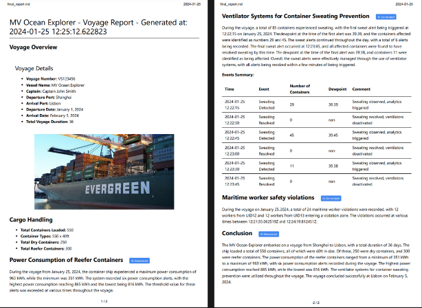

# Maritime Based AI Solution on Dell™ PowerEdge™ with NVIDIA® GPUs and Broadcom NetXtreme® Ethernet Adapter

## Table of Contents
* [Introduction](#introduction)
* [Recommended System Requirements](#recommended-system-requirements)
    * [Hardware](#hardware)
    * [Software](#software)
* [Maritime Transportation Solution](#maritime-transportation-solution)
    * [Building pipeline services](#building-pipeline-services)
    * [Running pipeline services](#running-pipeline-services)
    * [Building visualization services of application](#building-visualization-services-of-application)
    * [Running visualization services](#running-visualization-services)
    * [Application Dashboard](#application-dashboard)

* [Advanced Developer Configurations](#advanced-developer-configurations)

## Introduction

The Maritime based AI solution tackles critical challenges, highlighting the importance of vigilant cargo monitoring throughout sea transit to mitigate financial risks. This solution prioritizes concerns like container sweat, monitor power consumption for refrigerated cargo, and visual surveillance of maritime personnel in container stowage areas to prevent injuries. Upon voyage completion, it seamlessly generates comprehensive reports utilizing LLM technology.

For more details on the solution architecture and design refer [design.md](./design/design.md).


## Recommended System Requirements
### Hardware
* Dell™ PowerEdge™ server with NVIDIA® GPUs

### Software
* Ubuntu 22.04
* [Docker](https://docs.docker.com/engine/install/ubuntu/)
* [NVIDIA® CUDA®](https://developer.nvidia.com/cuda-toolkit) version 12.1
* [NVIDIA® Container Toolkit](https://docs.nvidia.com/datacenter/cloud-native/container-toolkit/latest/install-guide.html)

> Note: The solution is tested on Dell™ PowerEdge™ XR7620 with NVIDIA® 2xA100 GPUs.

## Maritime Transportation Solution

### Setting project home variable

1. Clone the repo.
2. Install the git-lfs on the machine by running the below commands

    ```sh
    sudo apt-get update
    sudo apt-get install git-lfs
    ```
3. Pull the LFS file using the command below
    ```sh
    cd <path-to-the-repo>/
    git lfs pull
    ```
4. Run the below command to set the project home variable.
    ```sh
    export PROJECT_HOME=<absolute path to repo>
    ```

### Setting permissions for log files

```sh
cd $PROJECT_HOME
```
```sh
sudo bash permission_handler.sh
```

### Building video AI pipeline services

> Note: By default, the solution is configured to run on 2 NVIDIA® GPUs. Refer [advanced settings section](#advanced-developer-configurations) to changes default settings
<details>
<summary>Prerequisites</summary>
Before deploying, make sure that all NVIDIA® GPU drivers are properly installed.

You can verify the GPU driver installation by running `nvidia-smi` on the server.

You should see a similar output as below for the command.

```sh
+---------------------------------------------------------------------------------------+
| NVIDIA-SMI 535.86.10              Driver Version: 535.86.10    CUDA Version: 12.2     |
|-----------------------------------------+----------------------+----------------------+
| GPU  Name                 Persistence-M | Bus-Id        Disp.A | Volatile Uncorr. ECC |
| Fan  Temp   Perf          Pwr:Usage/Cap |         Memory-Usage | GPU-Util  Compute M. |
|                                         |                      |               MIG M. |
|=========================================+======================+======================|
|   0  NVIDIA A100-SXM4-80GB          On  | 00000000:1B:00.0 Off |                  Off |
| N/A   33C    P0              62W / 500W |      4MiB / 81920MiB |      0%      Default |
|                                         |                      |             Disabled |
+-----------------------------------------+----------------------+----------------------+

+---------------------------------------------------------------------------------------+
| Processes:                                                                            |
|  GPU   GI   CI        PID   Type   Process name                            GPU Memory |
|        ID   ID                                                             Usage      |
|=======================================================================================|
|  No running processes found                                                           |
+---------------------------------------------------------------------------------------+
```

</details>
Follow the below steps to build the docker images

1. Run the below command to start the build.
    ```sh
    cd $PROJECT_HOME
    ```
    ```sh
    cd ./maritime_solution/ai_services/video_pipeline
    ```
    ```sh
    sudo docker compose build
    ```
### Running video AI pipeline services
> Note: Refer [advanced settings section](#advanced-developer-configurations) to changes default settings

Follow the below steps to run the docker containers.
1. Run the below command to start the build.
    ```sh
    sudo docker compose up -d
    ```
2. Once the all the services are running, run the below command to check health of all the services.
    ```sh
    sudo docker compose ps -a
    ```

### Building LLM report gen service

Follow the below steps to build the docker images
1. Run the below command to start the build.
    ```sh
    cd $PROJECT_HOME
    ```
    ```sh
    cd ./maritime_solution/ai_services/llm_server
    ```
    ```sh
    sudo docker compose build
    ```
### Running LLM report gen service
> Note: Refer [advanced settings section](#advanced-developer-configurations) to change default settings

Follow the below steps to run the docker containers.
1. Run the below command to start the build.
    ```sh
    sudo docker compose up -d
    ```
2. Once the all the services are running, run the below command to check health of all the services.
    ```sh
    sudo docker compose ps -a
    ```

### Building sensor simulator services

Follow the below steps to build the docker images
1. Run the below command to start the build.
    ```sh
    cd $PROJECT_HOME
    ```
    ```sh
    cd ./maritime_solution/ai_services/sensor_simulator
    ```
    ```sh
    sudo docker compose build
    ```
### Running sensor simulator services
> Note: Refer [advanced settings section](#advanced-developer-configurations) to change default settings

Follow the below steps to run the docker containers.
1. Run the below command to start the build.
    ```sh
    sudo docker compose up -d
    ```
2. Once the all the services are running, run the below command to check health of all the services.
    ```sh
    sudo docker compose ps -a
    ```

> Note: To restart the voyage, follow the instructions [here](#restart-voyage).
    
### Building visualization services of application

<details>
<summary>Deploy visualization services on another machine(optional)</summary>

1. To deploy visualization services on another machine refer [advanced settings section](#advanced-developer-configurations) to update broker IP in config file. 

2. Update below variables in [.env](./maritime_solution/visualization/.env) file

    ```sh
    AI_SERVICES_SERVER_IP="IP of the machine running AI services"
    VISUALIZATION_SERVER_IP="IP of the machine running visualization services"

    ```
</details>

Follow the below steps to build the docker images
1. Run the below command to start the build.
    ```sh
    cd $PROJECT_HOME
    ```
    ```sh
    cd ./maritime_solution/visualization
    ```
    ```sh
    sudo docker compose build
    ```
### Running visualization services

1. To access dashboard from remote machine. Navigate to [.env](./maritime_solution/visualization/.env) file and update below variable.
    ```sh
    VISUALIZATION_SERVER_IP="Deployment machine IP"

    ```

2. Run the below command to start the containers.
    ```sh
    cd ./maritime_solution/visualization
    ```
    ```sh
    sudo docker compose up -d
    ```
    ```sh
    sudo docker compose ps -a
    ```
### Application Dashboard
Once the visualization engine and dashboard services are successfully deployed, follow the below steps to view the dashboard.

1. On your deployment machine, open the [`localhost:7860/?__theme=dark`](http://localhost:7860/?__theme=dark) to open the Dashboard UI.
2. Click on the `Start Session` button to on the first panel as it appear to start the video streams. (The `Start Session` button might take some time to appear.)

Click on Voyage report tab on top to check the generated report of the last voyage



This report has been converted from markdown to pdf using the `Markdown PDF` VS Code extension available [here](https://marketplace.visualstudio.com/items?itemName=yzane.markdown-pdf).

## Restart Voyage

1. Run the below commands to restart the voyage simulation.

    ```sh
    cd $PROJECT_HOME
    ```
    ```sh
    cd ./maritime_solution/ai_services/sensor_simulator
    ```
    ```sh
    sudo docker compose restart route_simulator
    ```

## Advanced Developer Configurations

### Maritime Transportation Solution Pipeline
#### Configuring Pipeline
The pipeline can be configured to run multiple streams with custom configurations.

To configure the pipeline input streams, update the [./maritime_solution/config/simulator_config.yaml](./maritime_solution/config/simulator_config.yaml) file with the below details

| Name                        | Description                                                        |
|-----------------------------|--------------------------------------------------------------------|
| `voyage_number`             | Voyage number (e.g., VS123456)                                    |
| `vessel_name`               | Name of the vessel (e.g., MV Ocean Explorer)                      |
| `captain`                   | Name of the captain (e.g., Captain John Smith)                     |
| `departure_port`            | Departure port (e.g., Shanghai)                                    |
| `arrival_port`              | Arrival port (e.g., Lisbon)                                        |
| `departure_date`            | Departure date (e.g., January 1, 2024)                             |
| `arrival_date_est`          | Estimated arrival date (e.g., February 5, 2024)                    |
| `total_voyage_duration_days`| Total voyage duration in days (e.g., 36)                           |
| `total_containers`          | Total number of containers (e.g., 550)                             |
| `reefer_containers`         | Number of reefer containers (e.g., 300)                            |
| `container_type`            | Type of container (e.g., 40ft)                                     |
| `reefer_set_temp`           | Reefer set temperature (e.g., 2)                                   |
| `reefer_template`           | Path to reefer template (e.g., /app/config/reefer.csv)             |
| `dry_container_template`    | Path to dry container template (e.g., /app/config/drycontainer.csv)|
| `shipping_route`            | Path to shipping route (e.g., /app/config/route.csv)               |
| `route_sim_time`            | Route simulation time (e.g., 100)                                  |
| `video_pipeline_gpus`       | List of GPUs for video pipeline (e.g., [0])                        |
| `llm_gpus`                  | List of GPUs for LLM (e.g., [1])                                   |

##### Streams

| Name | Description |
| --- | ---- |
| `uri` | RTSP Stream URI or path to video file |
| `broker` | Zenoh broker IP (IP of machine running visualization ) |
| `visualize` | Enable visualization to stream output video on dashboard |
| `zone` | Zone coordinates configuration file name |

For example, each input streams should be configured as below
```yml
  CAM-TI1:
      url: rtsp://localhost:8554/trans.mp4
      broker: localhost
      zone: TI1.json
      visualize:  true
```

#### Configuring zone coordinates
The violation zones used for the solution is defined as coordinates as below.

```json
{
  "zone1": [
    {
      "x": 485,
      "y": 946
    },
    {
      "x": 336,
      "y": 1011
    },
    {
      "x": 540,
      "y": 1006
    },
    {
      "x": 755,
      "y": 1006
    },
    {
      "x": 866,
      "y": 942
    },
    {
      "x": 736,
      "y": 942
    }
  ]
}
```

Refer [this stackoverflow](https://stackoverflow.com/a/60445099) post for retrieving coordinates of the zones on RTSP camera stream using OpenCV python.


## Troubleshooting

Refer to this section for common issues faced while using Maritime Solution.

### Deployment - LLM Server

#### LLM Server not starting?

One possible reason of the LLM server not starting can be misconfiguration of GPU ids. if you get to see the line `ERROR - LLM GPU configured is wrong! Please correct it in simulator_config.yaml` in [app.log](./maritime_solution/ai_services/llm_server/app.log) then follow the following steps.

1. Check the number of gpus on your device by typing `nvidia-smi` where you can see number of gpus you have.

2. open the [simulator_config.yaml](./maritime_solution/config/simulator_config.yaml) and change the `gpu_config > llm_gpus` to any of you available GPU ids (if nvidia-smi shows you have 4 GPUS, their ids will be 0,1,2 and 3 respectively).

### Deployment - Video Pipeline

#### Video Pipeline not starting?

One possible reason of the Video Pipeline not starting can be misconfiguration of GPU ids. if you get to see the line `ERROR - Video Pipeline GPU configured is wrong! Please correct it in simulator_config.yaml` in [app.log](./maritime_solution/ai_services/video_pipeline/app.log) then follow the following steps.

1. Check the number of gpus on your device by typing `nvidia-smi` where you can see number of gpus you have.

2. open the [simulator_config.yaml](./maritime_solution/config/simulator_config.yaml) and change the `gpu_config > video_pipeline_gpus` to any of you available GPU ids (if nvidia-smi shows you have 4 GPUS, their ids will be 0,1,2 and 3 respectively).