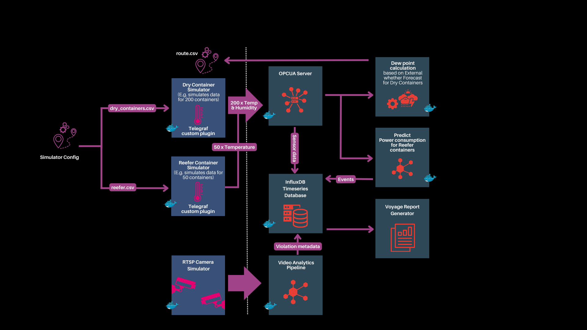

## Introduction

The Maritime based AI solution tackles critical challenges, highlighting the importance of vigilant cargo monitoring throughout sea transit to mitigate financial risks. This solution prioritizes concerns like container sweat, monitor power consumption for refrigerated cargo, and visual surveillance of maritime personnel in container stowage areas to prevent injuries. Upon voyage completion, it seamlessly generates comprehensive reports utilizing LLM technology.

### Architecture

The Maritime Transportation Solution consists of the following modules
### Maritime Transportation Solution Pipeline
Maritime Transportation Solution pipeline
* **Sensor Acquisition and Analytics Modules**:
    This module focuses on gathering data through various sensors deployed in maritime environments. These sensors capture information related to vessel navigation, environmental conditions, and other relevant parameters. The collected data undergoes thorough analytics to derive insights, enabling proactive decision-making and optimized operational strategies.

    * **[OPCUA Server](https://opcfoundation.org/about/opc-technologies/opc-ua/)**: The OPC Unified Architecture (OPC UA) serves as a machine-to-machine communication protocol designed for industrial automation, developed by the OPC Foundation. Additionally, it functions as a brownfield server on a ship, enabling all sensors to seamlessly publish data.
    * **Dry Container Sensor Simulator**: This module replicates the conditions inside a dry container by simulating temperature and humidity sensor data. Specifically, it generates artificial data that emulates the readings one would expect from sensors monitoring the temperature and humidity levels within a container. The simulated data is then written to an OPC UA server.
    * **Reefer Container Sensor Simulator**:  This module replicates the conditions inside a reefer container by simulating temperature sensor data. The simulated data is then written to an OPC UA server.
    * **Container Sweat Analytics**: This module shall read the current temperature and humidity values of the dry containers from OPCUA server and calculate dew point temperature and compare it with external temperature and raise alert event if the external temperature drops below the dew point temperature of the container
    **References:**
        * [Dew point formula](https://iridl.ldeo.columbia.edu/dochelp/QA/Basic/dewpoint.html)
        * [Container sweating/raining](https://mohawkglobal.com/wp-content/uploads/2020/06/Its-raining-inside-my-container.pdf)
    * **Power Consumption Predictor**: This module uses “DecisionTreeRegressor” model trained using Pycaret on simulated data of power consumption, external temperature and reefer set temperature. This module will take the actual current external temperature and predict the power consumption for the next one hour.

* **Safety Monitoring of Maritime Workers**:
Visual monitoring of maritime workers in container stowage zones during voyages avoids  physical injuries.

    * **RTSP Simulator**: This module shall simulate RTSP (Real Time Streaming Protocol) camera streams.
    * **Video Pipeline**: This module decodes frames from an RTSP source, employing the Yolov8s model to detect individuals within the video frame. It then assesses whether the detected persons are within the pre-configured violation zone, subsequently publishing post-processed, uncompressed video frames to a visualization machine via Zenoh networked using Broadcom NIC.

* **Compliance Report Generator Modules**:
In the post-voyage phase, a compliance report generator tool is employed to extract key events from a time series database (InfluxDB), specifically focusing on Container sweat alerts, Predicted power threshold alerts, and Maritime worker safety violations. The tool creates a detailed text file, as exemplified in the attached sample, summarizing events with timestamps. Embedding vectors for the time series data are generated using the Hugging Face LangChain API, utilizing the "gte-large" embedding model, and stored in ChromaDB. The AI-generated sections of the report leverage the "Zephyr 7B" model, drawing context from ChromaDB to produce insightful narratives on Container sweat events, Power usage alerts, Maritime worker safety violations, and an overall report summary. This integrated approach ensures a comprehensive and contextually rich analysis of the voyage's compliance-related aspects.

* **Visualization Modules**:
    * **[Zenoh](https://zenoh.io/)**: Zenoh fosters a flexible and robust framework for communication, data distribution, and collaboration among devices and applications within an IoT, edge computing, or distributed system.
    * **[Telegraf](https://www.influxdata.com/time-series-platform/telegraf/)**: Telegraf serves as a versatile and lightweight agent, capable of collecting a wide variety of metrics from diverse sources, processing that data, and sending it to different endpoints for storage, monitoring, or analysis.

    * **[InfluxDB](https://www.influxdata.com/)**: InfluxDB is an open-source, high-performance time-series database, designed for efficient storage and retrieval of time-stamped data, commonly used in monitoring, IoT, and DevOps applications for real-time analytics and visualization.

    * **Operator Dashboard**:  offers a comprehensive view of the voyage status, providing real-time updates on vessel location, alerts, and key insights. It delivers instant information on Container sweating, power consumption for reefer containers and visual monitoring of maritime workers

### Solution Flow Diagram
