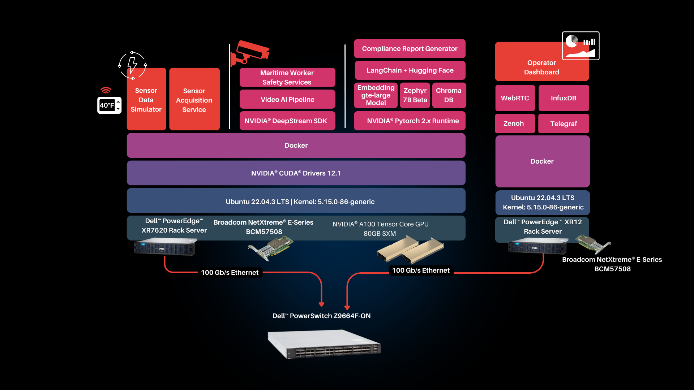

# Performance Testing for Maritime Based AI Solution on Dell™ PowerEdge™ with Broadcom Ethernet

## 1. Introduction

Scalers AI has developed a maritime shipping solution that tackles critical challenges, highlighting the importance of vigilant cargo monitoring throughout sea transit to mitigate financial risks. This solution prioritizes concerns like container sweat, monitor power consumption for refrigerated cargo, and visual surveillance of maritime personnel in container stowage areas to prevent injuries. Upon voyage completion, it seamlessly generates comprehensive reports utilizing LLM technology.

### 1.1 Objective

* Evaluate the scalability of the solution by segregating the visualization and inference services. Utilize Broadcom Ethernet to transmit the uncompressed video stream for encoding, and streaming via WebRTC on the browser. Finally, capture time taken to generate voyage report upon completion.
* Gauge performance and resource utilization across varying numbers of concurrent streams.

## 2. Test Environment

### 2.1 Hardware Configuration

The Hardware configuration used for the testing is as shown below

The cluster consists of two Dell™ PowerEdge™ servers
| Server | CPU | RAM | Disk | GPU |
| --- | --- | --- | --- | --- |
| Dell™ PowerEdge™ XR7620 | Intel(R) Xeon(R) Silver 4416+ | 128 GB | 500 GB | 2xNVIDIA® A100  |
| Dell™ PowerEdge™ XR12 | Intel(R) Xeon(R) Gold 5318Y | 256 GB | 10 TB |  |

Each server is networked to an Dell™ PowerSwitch Z9664F-ON through Broadcom NetXtreme® E-Series BCM57508 NICs with 100 Gb/s bandwidth.

### 2.2 Software Configuration

#### 2.2.1 Docker and NVIDIA® CUDA®
| Software | Version |
| --- | ---- |
| [Docker](https://docs.docker.com/engine/install/) | `24.0.7` |
| [NVIDIA® CUDA®](https://docs.nvidia.com/cuda/cuda-installation-guide-linux/index.html) | `v12.1` |

#### 2.2.2 Software Components
| Software | Version |
| --- | ---- |
| [Deepstream](https://docs.nvidia.com/metropolis/deepstream/dev-guide/text/DS_docker_containers.html) | `6.4` |
| [Zenoh](https://github.com/eclipse-zenoh/zenoh) | `0.10.1rc0` |
| [opcua](https://pypi.org/project/asyncua/1.0.6/) | `1.0.6` |
| [influxdb](https://github.com/influxdata/influxdb) | `1.7.10` |
| [telegraf](https://github.com/influxdata/telegraf/tree/master) | `1.22.3` |
| [transformers](https://github.com/huggingface/transformers) | `4.37.2` |
| [langchain](https://github.com/langchain-ai/langchain) | `0.1.5` |

### 2.3 AI Models

| Model | Type |
| --- | --- |
| [Yolov8s](https://docs.ultralytics.com/) | CV |
| [Zephyr 7b](https://huggingface.co/HuggingFaceH4/zephyr-7b-beta) | LLM |
| [GTE Large](https://huggingface.co/thenlper/gte-large) | Embedding |

## 3. Test Scenarios

- Test scenarios executed with varying numbers of concurrent streams.
- Video pipeline, sensor simulator modules, and OPCUA server deployed on Dell™ PowerEdge™ XR7620. Refer [architecture](#21-hardware-configuration)
- Visualization services, including encoding, set up on Dell™ PowerEdge™ XR12. Refer [architecture](#21-hardware-configuration)
- The video streams are scaled evenly across both GPUs.
- Each scenario runs for 10 minutes.
- Captured metrics represent average over the 10m duration.
- FPS per stream includes decoding, inference, post-processing, and publishing of uncompressed stream.

### 3.1 Scaling Video pipeline

The below table describes showcases performance of video pipeline while scaling concurrent streams.

| Device             | CPU_SKU                           | GPU_SKU      | Number of Streams | AVG FPS / Stream | Throughput (FPS) | Avg Bandwidth Util (Gbits/s) | Max Bandwidth Util (Gbits/s) | Avg GPU Util (%) | Avg GPU Memory Util (%) |
|--------------------|----------------------------------|--------------|-------------------|------------------|------------------|-------------------------------|------------------------------|-------------------|-------------------------|
| Dell™ PowerEdge™ XR7620   | 2 x Intel(R) Xeon(R) Silver 4416+ | 2 x NVIDIA® A100 | 1                 | 29.97            | 29.97            | 1.56                          | 3.13                         | 4.5               | 0.48                    |
| Dell™ PowerEdge™ XR7620   | 2 x Intel(R) Xeon(R) Silver 4416+ | 2 x NVIDIA® A100 | 2                 | 29.99            | 59.98            | 3.07                          | 6.25                         | 9.43              | 7.5                     |
| Dell™ PowerEdge™ XR7620   | 2 x Intel(R) Xeon(R) Silver 4416+ | 2 x NVIDIA® A100 | 4                 | 29.64            | 118.56           | 6.25                          | 12.5                         | 20.8              | 1.77                    |
| Dell™ PowerEdge™ XR7620   | 2 x Intel(R) Xeon(R) Silver 4416+ | 2 x NVIDIA® A100 | 8                 | 29.35            | 234.8            | 12.5                          | 25.0                         | 43.4              | 3.45                    |
| Dell™ PowerEdge™ XR7620   | 2 x Intel(R) Xeon(R) Silver 4416+ | 2 x NVIDIA® A100 | 10                | 29.67            | 296.7            | 15.3                          | 31.2                         | 55.9              | 4.33                    |
| Dell™ PowerEdge™ XR7620   | 2 x Intel(R) Xeon(R) Silver 4416+ | 2 x NVIDIA® A100 | 12                | 29.72            | 356.6            | 18.4                          | 37.4                         | 66.5              | 5.30                    |
| Dell™ PowerEdge™ XR7620   | 2 x Intel(R) Xeon(R) Silver 4416+ | 2 x NVIDIA® A100 | 16                | 29.82            | 477.1            | 24.6                          | 50.0                         | 88.7              | 6.91                    |
| Dell™ PowerEdge™ XR7620   | 2 x Intel(R) Xeon(R) Silver 4416+ | 2 x NVIDIA® A100 | 20                | 29.78            | 595.6            | 30.6                          | 62.4                         | 99.2              | 8.67                    |
| Dell™ PowerEdge™ XR7620   | 2 x Intel(R) Xeon(R) Silver 4416+ | 2 x NVIDIA® A100 | 24                | 27.24            | 653.7            | 34.6                          | 67.9                         | 98.5              | 10.44                   |

### 3.2 Report generation

Once the Voyage is completed Voyage report is taking 46 seconds. Report generation includes
- Query power consumption, container sweating and worker violation events from InfluxDB and create text files.
- Vectors are generated using Hugging face LangChain API with the “gte-large” embedding model and stored in ChromaDB.
- Generate summary for below sections using “Zephyr 7B” model using the context from ChromaDB.
    - Container sweat
    - Power usage alerts 
    - Maritime worker safety violation
- Generate complete report summary using “Zephyr 7B” model using the content generated for the other sections of the report.

Below is the deployment configuration while report generation time is calculated.
- Four concurrent video streams are running on GPU 1.
- LLM inference is running on GPU 2.  
## 4. Test Workload Configuration

All input streams are simulated as RTSP streams and set to 1080p resolution.

## 5. Test Metrics

The below are the metrics measured for each tests

| Metric | Explanation |
| -- | ---- |
| Device | Specific hardware device being running inference workload |
| CPU_SKU | Indicates the CPU model or SKU |
| GPU_SKU | Indicates the GPU model or SKU |
| Number of Streams |  Number of concurrent input streams being processed during the test |
| AVG FPS / Stream | Average frames per second (FPS) processed per stream during the test |
| Throughput (FPS) | Total throughput, measured in frames per second, across all streams during the test |
| Avg Bandwidth Util (Gbits/s) | Average bandwidth utilization in gigabits per second (Gbits/s) during the test |
| Max Bandwidth Util (Gbits/s) | Maximum bandwidth utilization in gigabits per second (Gbits/s) observed during the test |
| Avg GPU Util (%) | Average GPU utilization as a percentage during the test |
| Avg GPU Memory Util (%) | Average GPU memory utilization as a percentage during the test |